# Load Balancer

A load balancer sits between clients and backend servers. It receives incoming
traffic and forwards each request or connection to a healthy backend.

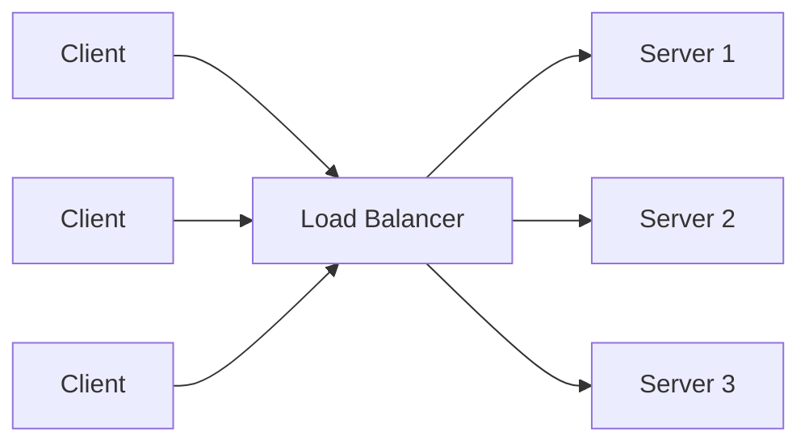

## Why We Need It

Without a load balancer, clients connect directly to one server. That creates a
few problems:

- One server can become overloaded.
- A server failure can make the whole application unavailable.
- Scaling requires clients to know about new servers.
- Deployments become risky because traffic is tied to specific machines.

A load balancer helps with:

- **Scalability:** distribute traffic across many servers.
- **Availability:** stop sending traffic to unhealthy servers.
- **Fault tolerance:** keep the system working when one backend fails.
- **Operational flexibility:** add, remove, or deploy servers behind one stable endpoint.
- **Performance:** reduce hot spots and keep latency more predictable.
- **Security:** hide backend servers and centralize TLS, WAF, and rate limiting.

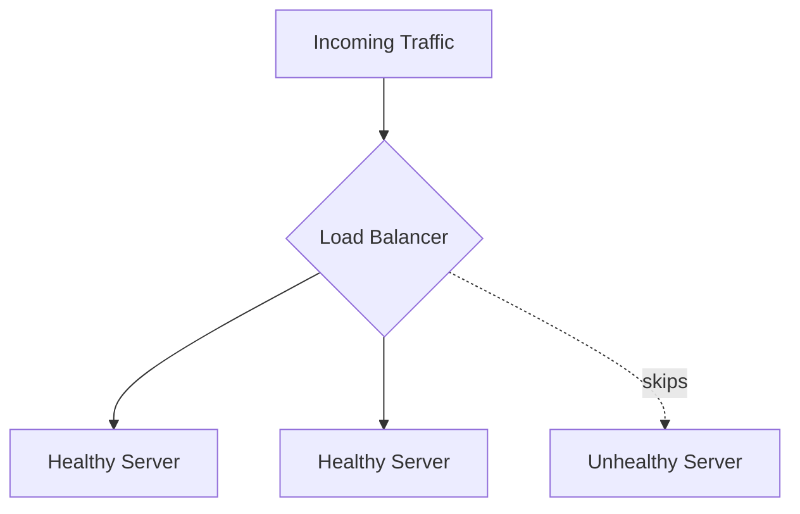

## Where Load Balancers Sit

Load balancers can exist at different places in a system.


Common placements:

- **Public load balancer:** accepts internet traffic and forwards it to app servers.
- **Internal load balancer:** balances traffic between private services.
- **Global load balancer:** routes users to the closest or healthiest region.
- **DNS load balancing:** returns different IPs for the same domain.
- **Client-side load balancing:** client or SDK chooses a backend from service discovery.
- **Service mesh load balancing:** sidecar proxies balance service-to-service traffic.

## Types Of Load Balancers

| Type | Example | Best For |
| --- | --- | --- |
| Hardware | F5, Citrix ADC | Large enterprises, dedicated appliances |
| Software | NGINX, HAProxy, Envoy | Flexible self-managed systems |
| Cloud managed | AWS ALB/NLB, GCP Cloud Load Balancing, Azure Load Balancer | Managed scaling and availability |
| DNS-based | Route 53 weighted/latency routing | Region-level or simple traffic distribution |
| Service mesh | Envoy via Istio/Linkerd | Microservice-to-microservice traffic |

For most modern systems, teams use managed cloud load balancers at the edge and
software/service-mesh load balancing internally.

## L4 vs L7 Load Balancing

Load balancers commonly work at Layer 4 or Layer 7 of the OSI model.

| Type | Layer | Uses | Can Inspect | Example Decision |
| --- | --- | --- | --- | --- |
| L4 | Transport | TCP/UDP | IP, port, protocol | Send TCP connection to server 2 |
| L7 | Application | HTTP/HTTPS/gRPC | URL, headers, cookies, method, body metadata | Send `/api/payments` to payment service |

### L4 Load Balancer

An L4 load balancer routes connections based on network-level information.

It is usually faster because it does not need to understand the application
request.

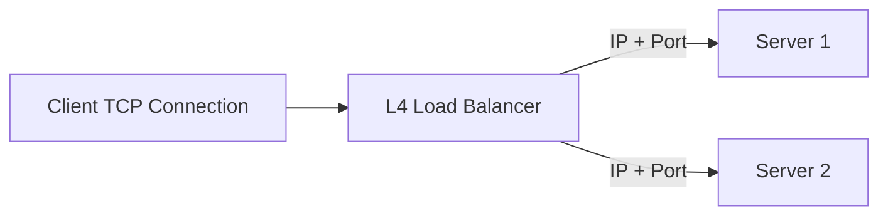

Use L4 when:

- You need very high performance.
- You are balancing TCP or UDP traffic.
- You do not need request-aware routing.

### L7 Load Balancer

An L7 load balancer understands application protocols such as HTTP.

It can make smarter routing decisions based on request data.

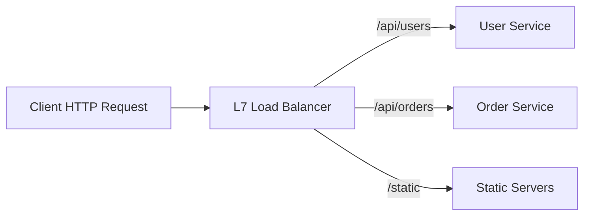

Use L7 when:

- You need path-based or host-based routing.
- You need header, cookie, or method-based routing.
- You want TLS termination at the load balancer.
- You want application-aware observability or rate limiting.

### L4 vs L7 Tradeoffs

| Concern | L4 | L7 |
| --- | --- | --- |
| Speed | Usually faster | Usually more processing |
| Routing intelligence | Lower | Higher |
| Protocol awareness | TCP/UDP | HTTP, HTTPS, gRPC, WebSocket |
| TLS handling | Often pass-through | Often termination |
| Observability | Connection-level | Request-level |
| Use case | Databases, TCP services, high-throughput APIs | Web apps, microservices, API routing |

## Round Robin

Round Robin sends requests to servers in order.

Example with three servers:

1. Request 1 goes to server 1.
2. Request 2 goes to server 2.
3. Request 3 goes to server 3.
4. Request 4 goes back to server 1.

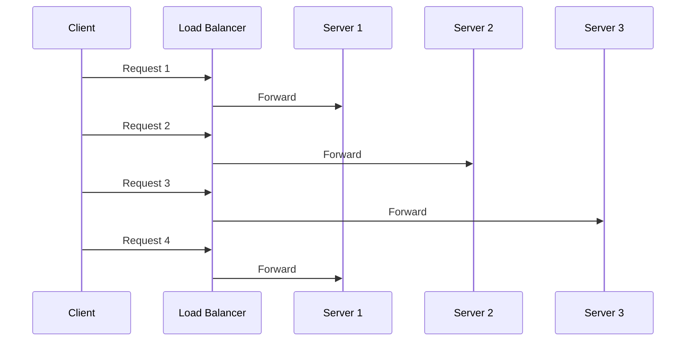

Pros:

- Simple.
- Easy to understand.
- Works well when servers have similar capacity and requests have similar cost.

Cons:

- Does not account for slow or overloaded servers.
- Does not account for heavy requests.

## Least Connections

Least Connections sends the next request to the server with the fewest active
connections.

This is better when requests have different durations.

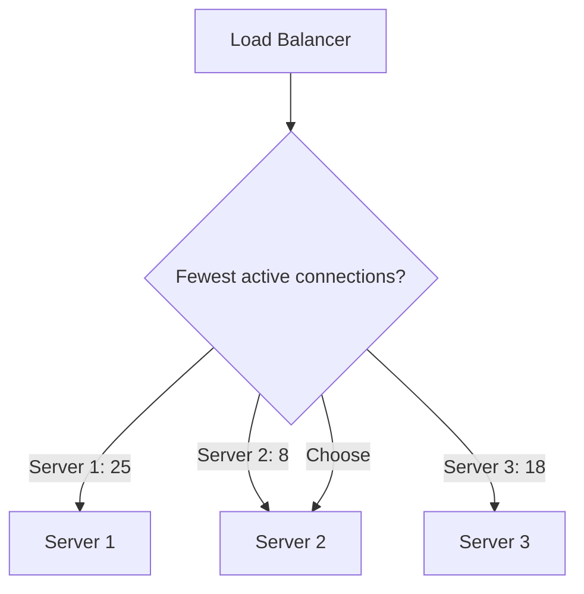

Pros:

- Handles uneven request duration better than Round Robin.
- Helps avoid sending more work to already busy servers.

Cons:

- Requires tracking active connections.
- Active connections do not always equal actual CPU or memory load.

## Other Load Balancing Algorithms

Round Robin and Least Connections are the common starting points, but real
systems often need more specific algorithms.

| Algorithm | How It Works | Use When |
| --- | --- | --- |
| Weighted Round Robin | Sends more requests to servers with higher weights | Servers have different capacity |
| Weighted Least Connections | Combines weights with active connection count | Larger servers should handle more active work |
| IP Hash / Source Hash | Same client IP maps to the same backend | You need simple affinity without cookies |
| Least Response Time | Chooses the server with low latency and low active load | Latency varies across backends |
| Random | Picks a random healthy server | Simple, low coordination |
| Power Of Two Choices | Picks two random servers, chooses the better one | Large clusters where simple random is too uneven |
| Consistent Hashing | Maps keys to servers with minimal remapping on changes | Caches, sharded systems, sticky key ownership |

### Weighted Round Robin

If server 1 is twice as powerful as server 2, it can receive twice the traffic.

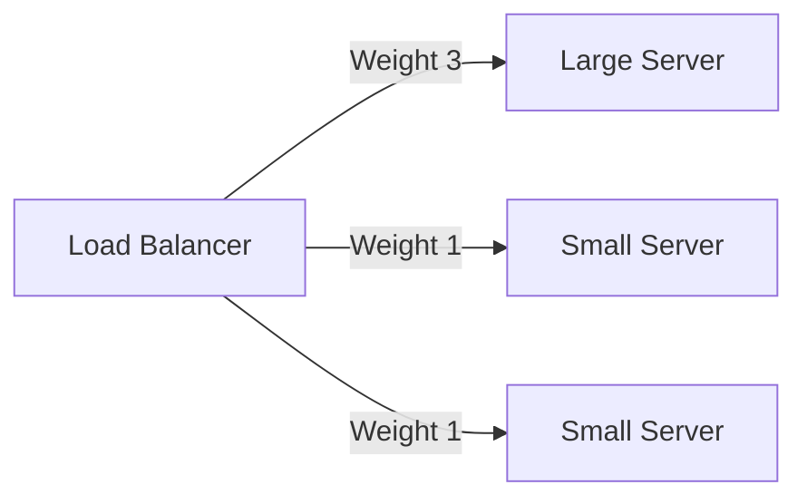

Use this when backend machines are not equal.

### Consistent Hashing

Consistent hashing is useful when a request should go to the server responsible
for a specific key, such as a user ID, cache key, or tenant ID.

It reduces reshuffling when servers are added or removed.

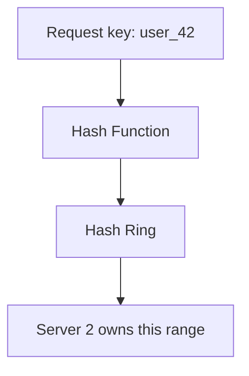

This matters for caches because moving too many keys at once can cause a cache
miss storm.

## Health Checks

Health checks help the load balancer decide which servers can receive traffic.

A health check can be:

- **TCP check:** can the load balancer open a connection?
- **HTTP check:** does `/health` return a successful response?
- **Application check:** are dependencies like database/cache reachable?

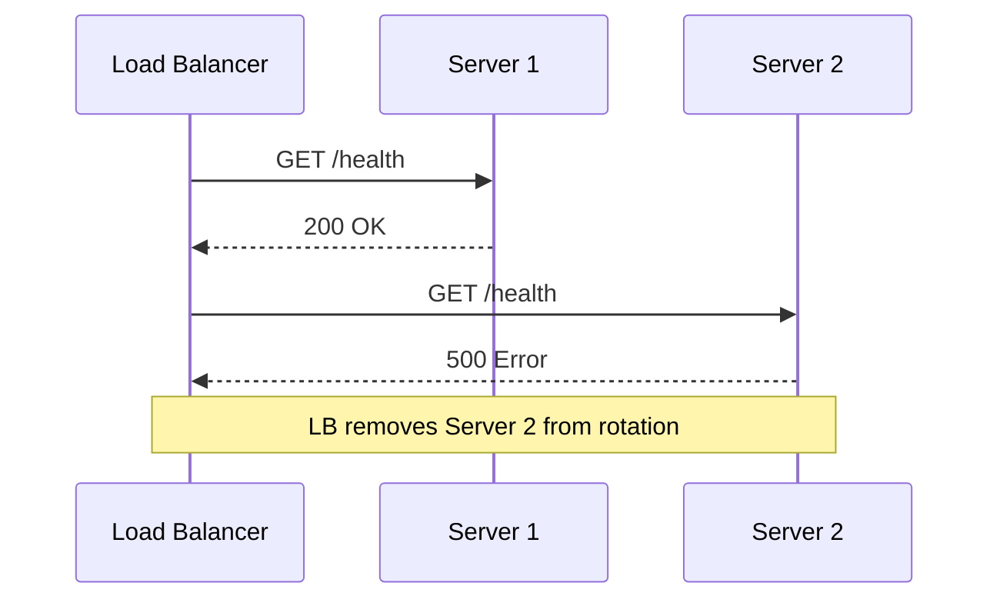

Important settings:

- **Interval:** how often to check.
- **Timeout:** how long to wait for a response.
- **Healthy threshold:** how many successes before adding a server back.
- **Unhealthy threshold:** how many failures before removing a server.

### Good Health Check Design

A health endpoint should answer one question: "Can this server safely receive
traffic right now?"

Common levels:

- **Liveness:** is the process running?
- **Readiness:** is the server ready to receive traffic?
- **Dependency health:** can it reach critical dependencies?

Be careful with dependency checks. If every server marks itself unhealthy because
one shared database is down, the load balancer may remove all servers. Sometimes
it is better for the app to return controlled errors than to disappear from the
load balancer completely.

Good health checks should be:

- Fast.
- Lightweight.
- Auth-protected or private when possible.
- Representative of real serving ability.
- Not dependent on slow external systems unless truly required.

## Connection Draining

Connection draining means removing a server from new traffic while allowing
existing requests to finish.

This is important during deployments, autoscaling, and maintenance.

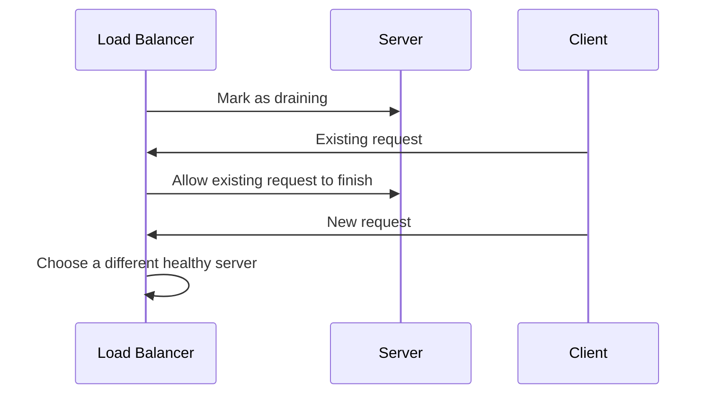

Without connection draining, users may see failed requests during deployments.

Typical flow:

1. Mark server as draining.
2. Stop sending new requests to it.
3. Wait for in-flight requests to finish or timeout.
4. Shut down or deploy the server.
5. Add it back after health checks pass.

## Timeouts And Retries

Load balancers usually enforce timeouts so requests do not hang forever.

Important timeouts:

- **Client timeout:** how long the load balancer waits for the client.
- **Backend timeout:** how long the load balancer waits for the server.
- **Idle timeout:** how long an inactive connection stays open.
- **Connect timeout:** how long to wait while opening a backend connection.

Retries can improve reliability, but they can also make outages worse.

Safe retry examples:

- Retry idempotent `GET` requests.
- Retry when the backend connection fails before the request is sent.
- Retry a request with an idempotency key.

Risky retry examples:

- Retrying payment creation without idempotency.
- Retrying expensive writes during overload.
- Retrying too many times and multiplying traffic.

Use retries with:

- Small retry limits.
- Backoff.
- Jitter.
- Idempotency keys for writes.
- Clear timeout budgets.

## High Availability For The Load Balancer

A load balancer improves backend availability, but the load balancer itself must
not become a single point of failure.

Common HA patterns:

- **Active-passive:** one load balancer serves traffic, another waits as backup.
- **Active-active:** multiple load balancers serve traffic at the same time.
- **Multi-AZ deployment:** load balancers run across availability zones.
- **Anycast or DNS failover:** traffic moves to another location if one fails.

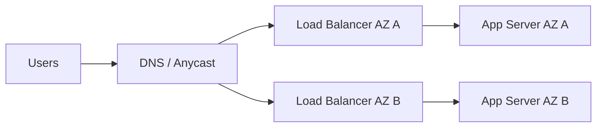

In cloud systems, managed load balancers usually handle this internally, but you
still need to deploy backends across multiple zones.

## Sticky Sessions

Sticky sessions send the same client to the same backend server across multiple
requests.

This is useful when session state is stored locally on a server.

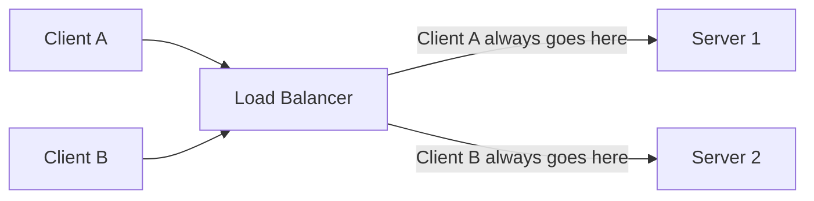

Sticky sessions can be implemented using:

- Source IP address.
- Cookies.
- Session IDs.

Pros:

- Useful for legacy applications that keep session state in memory.
- Can reduce repeated cache warming for the same user.

Cons:

- Uneven traffic distribution.
- Harder failover when a server dies.
- Makes horizontal scaling less clean.

Prefer storing session state in a shared system such as Redis, a database, or a
stateless signed token when possible.

## TLS And HTTPS

Load balancers often handle HTTPS traffic.

Common TLS patterns:

| Pattern | Meaning | Use When |
| --- | --- | --- |
| TLS termination | Client HTTPS ends at the load balancer; backend may use HTTP | Simpler certificate management |
| TLS pass-through | Load balancer forwards encrypted traffic without decrypting | Backend must own TLS; useful for strict end-to-end encryption |
| TLS re-encryption | Client HTTPS ends at LB, then LB opens HTTPS to backend | You want inspection plus encrypted internal traffic |
| mTLS | Both client and server verify certificates | Strong service-to-service identity |

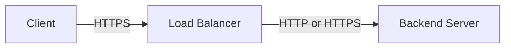

TLS termination benefits:

- Centralized certificate management.
- Easier HTTP routing and observability.
- Backend services can avoid public certificate handling.

TLS termination tradeoffs:

- Traffic from load balancer to backend may need separate encryption.
- The load balancer must be trusted because it can see decrypted requests.

## DNS Load Balancing And Global Load Balancing

DNS load balancing distributes traffic by returning different IP addresses for
the same domain.

Example:

```text
api.example.com -> 203.0.113.10
api.example.com -> 203.0.113.20
api.example.com -> 203.0.113.30
```

DNS-based balancing is useful for:

- Routing users to nearby regions.
- Simple traffic distribution.
- Disaster recovery.
- Weighted migrations between regions.

Limitations:

- DNS responses can be cached by clients and resolvers.
- Failover is not always instant.
- DNS does not know about every individual request.

Global load balancers are smarter. They can consider region health, latency,
capacity, and routing policy.

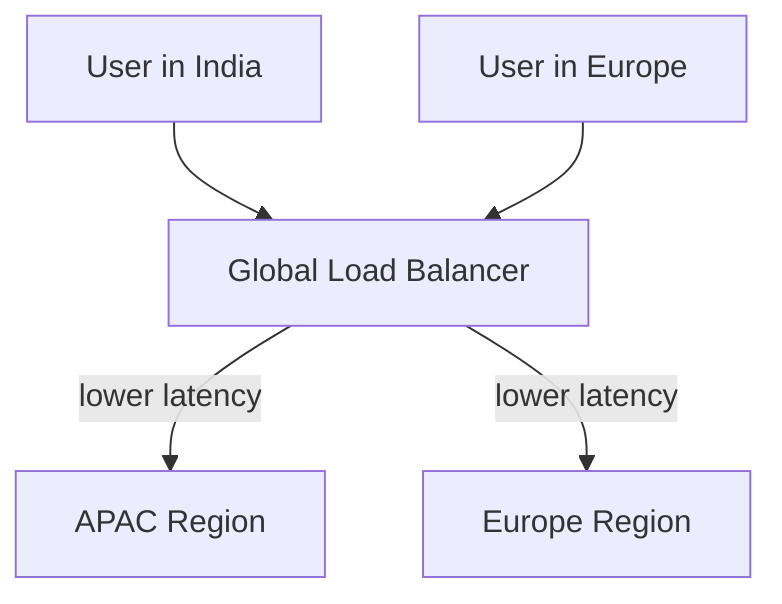

## Load Balancer vs Reverse Proxy vs API Gateway

These terms overlap, but they are not exactly the same.

| Component | Main Job | Common Features |
| --- | --- | --- |
| Load Balancer | Distribute traffic across backends | Health checks, balancing algorithms, failover |
| Reverse Proxy | Sit in front of servers and forward requests | TLS termination, caching, compression, routing |
| API Gateway | Manage API traffic | Auth, rate limits, quotas, request validation, API versions |

In practice, one product can do all three. For example, an L7 load balancer may
also behave like a reverse proxy and provide gateway features.

## Common Load Balancer Features

- **TLS termination:** decrypt HTTPS at the load balancer.
- **Rate limiting:** protect services from excessive requests.
- **Request routing:** route by host, path, header, or method.
- **Retries:** retry failed requests when safe.
- **Connection pooling:** reuse backend connections efficiently.
- **Compression:** reduce response size.
- **Caching:** store frequently requested responses near users.
- **WAF integration:** block suspicious traffic before it reaches the app.
- **Access logs:** record request metadata for debugging and audits.
- **Observability:** collect metrics, logs, and traces.

## Failure Modes

Load balancers help with failures, but they can also introduce new ones.

Common failure modes:

- **Bad health checks:** healthy servers get removed or unhealthy servers stay in rotation.
- **Retry storm:** retries multiply traffic during an outage.
- **Uneven traffic:** sticky sessions or bad weights overload a subset of servers.
- **Overloaded load balancer:** the balancer itself runs out of CPU, memory, ports, or connections.
- **Bad deployment:** new version passes shallow health checks but fails real requests.
- **Dependency outage:** all backends fail because they share the same database/cache.
- **Slow backend:** server responds slowly but still passes basic health checks.
- **Misconfigured timeouts:** clients wait too long or requests fail too quickly.

How to reduce risk:

- Use readiness checks, not just process checks.
- Use connection draining before shutdown.
- Keep retry limits small.
- Monitor backend latency and error rates.
- Deploy gradually with canaries or weighted routing.
- Keep load balancers highly available.

## Metrics To Watch

Important load balancer metrics:

- Request rate.
- Active connections.
- New connections per second.
- Backend latency.
- Load balancer latency.
- 4xx and 5xx error rates.
- Healthy and unhealthy backend count.
- Connection timeout count.
- Retry count.
- TLS handshake errors.
- Dropped or rejected connections.

Important logs:

- Client IP.
- Request path and method.
- Backend target.
- Response status.
- Response time.
- User agent.
- Trace/request ID.

## Real-World Examples

| Tool / Service | Notes |
| --- | --- |
| NGINX | Popular reverse proxy and L7 load balancer |
| HAProxy | Very strong L4/L7 load balancer, common for high throughput |
| Envoy | Modern proxy used in service meshes and cloud-native systems |
| AWS ALB | L7 HTTP/HTTPS load balancer |
| AWS NLB | L4 TCP/UDP load balancer for very high performance |
| AWS Gateway Load Balancer | Used for network appliances like firewalls |
| GCP Cloud Load Balancing | Global managed load balancing |
| Azure Load Balancer / Application Gateway | L4 and L7 managed options |

## Design Checklist

When designing a system with a load balancer, ask:

- Is traffic HTTP, TCP, UDP, WebSocket, or gRPC?
- Do we need L4 or L7 routing?
- Is the load balancer public or internal?
- Are backends deployed across multiple zones?
- What algorithm should distribute traffic?
- Do all servers have equal capacity?
- What health check proves a server is ready?
- What happens during deployment or scale-in?
- Do we need sticky sessions?
- Where does TLS terminate?
- What are the timeout and retry policies?
- How do we prevent the load balancer from being a single point of failure?
- What metrics and logs are needed for debugging?

## Example Interview Answer

If asked "How would you add a load balancer to this system?", a strong answer
could be:

> I would put a managed L7 load balancer in front of the application servers if
> this is HTTP traffic. It would route only to healthy instances using readiness
> checks, spread traffic with round robin or least connections, and support
> connection draining during deployments. I would deploy backends across multiple
> availability zones so one zone failure does not take down the service. TLS can
> terminate at the load balancer, and I would monitor request rate, latency,
> error rate, active connections, and healthy backend count. If sessions are
> stored locally, sticky sessions may be needed, but I would prefer moving
> session state to Redis or signed tokens so the app remains stateless.

## Capacity Example

Suppose:

- One server can safely handle 1,000 requests per second.
- Expected peak traffic is 8,000 requests per second.
- We want 30% headroom.

Required capacity:

```text
8,000 RPS * 1.3 = 10,400 RPS
10,400 RPS / 1,000 RPS per server = 10.4 servers
```

So we need at least 11 servers. In practice, we may run 12 or more across
multiple availability zones.

Also remember that capacity is not only requests per second. You may also be
limited by:

- CPU.
- Memory.
- Network bandwidth.
- Open connections.
- TLS handshakes.
- Backend database capacity.

## Quick  Summary

Use a load balancer to distribute traffic, improve availability, and hide backend
server changes from clients.

L4 load balancing is faster and works at the connection level. L7 load balancing
is smarter and works at the request level.

Round Robin is simple but does not consider server load. Least Connections is
better when requests have different durations. Health checks prevent traffic from
going to unhealthy servers. Sticky sessions keep a user on the same backend, but
they can hurt scalability and failover.

Production load balancing also needs connection draining, sane timeouts,
controlled retries, TLS strategy, multi-zone high availability, and monitoring.
For global systems, use DNS or global load balancing to route users across
regions.

## Things To Remember

- A load balancer should only send traffic to healthy servers.
- L4 routes connections; L7 routes requests.
- Round Robin assumes servers and requests are roughly equal.
- Least Connections adapts better to long-running requests.
- Sticky sessions are sometimes useful, but stateless services scale better.
- Connection draining prevents deployment-related request failures.
- Retries need limits, backoff, and idempotency.
- The load balancer itself must be highly available.
- Watch latency, errors, active connections, and healthy backend count.
