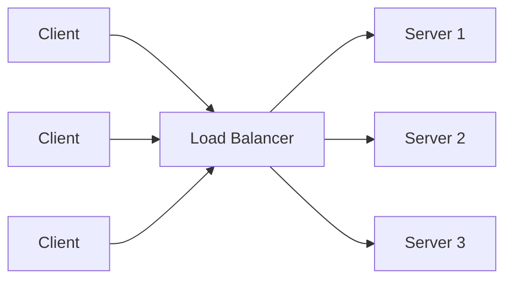
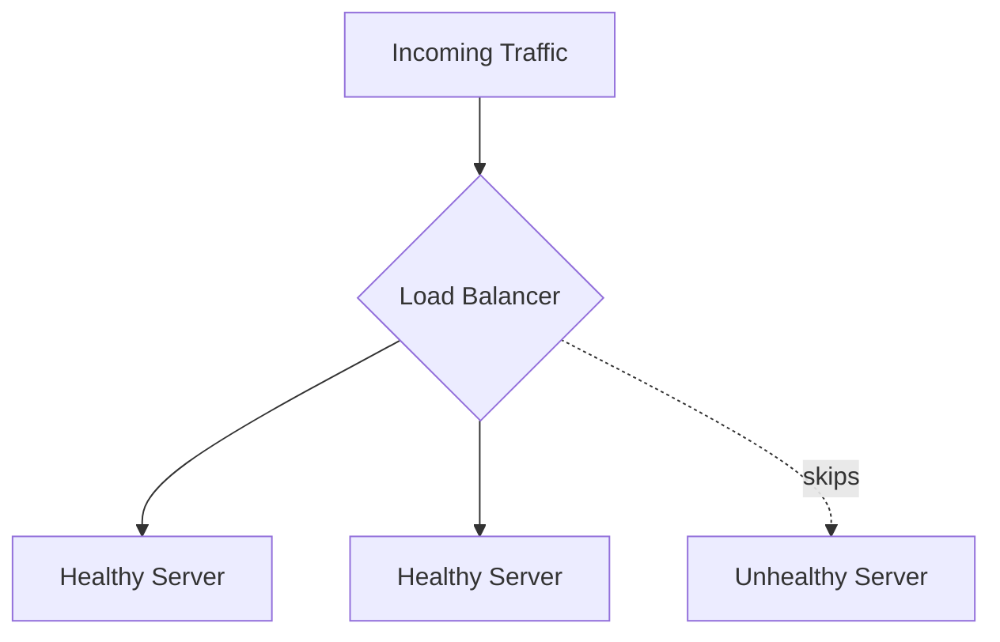
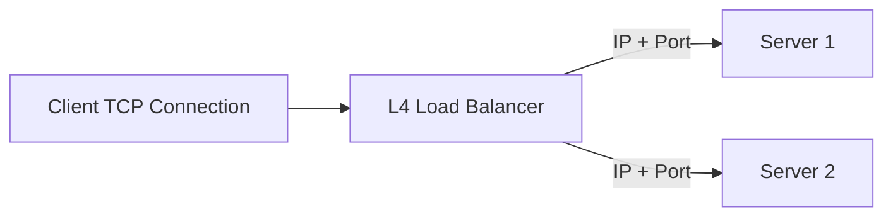
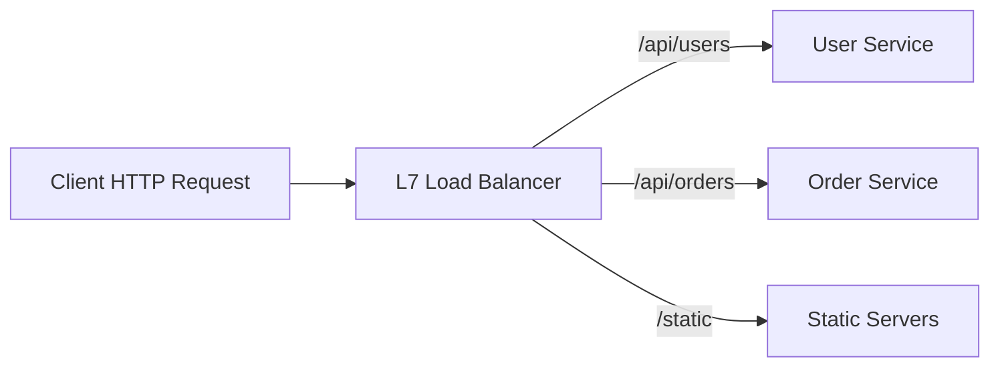
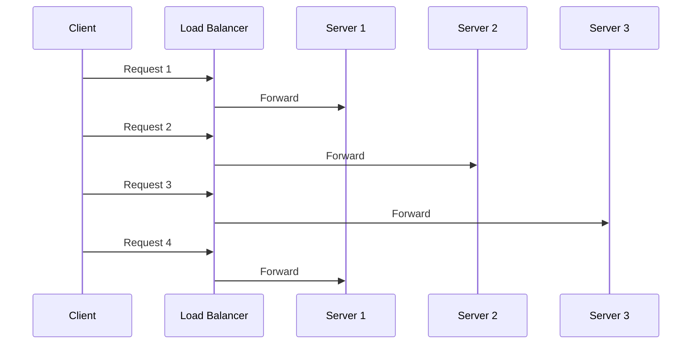
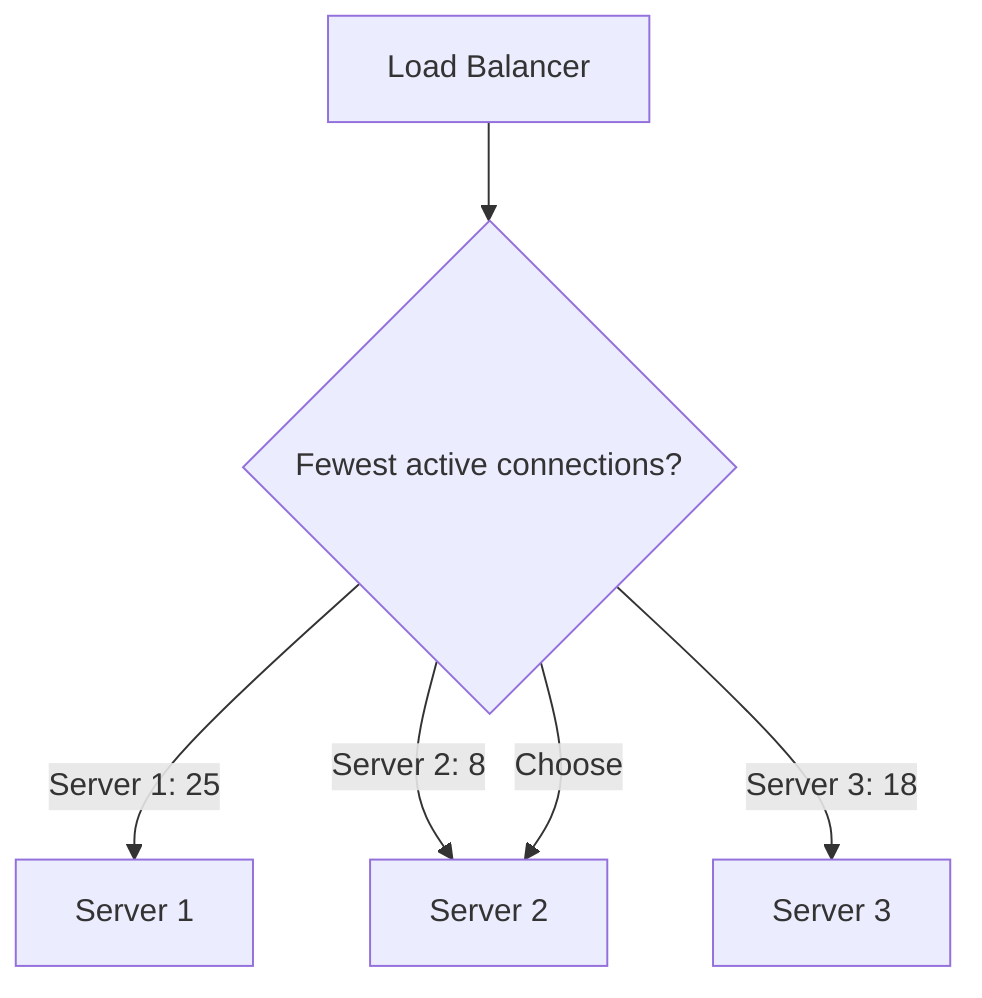
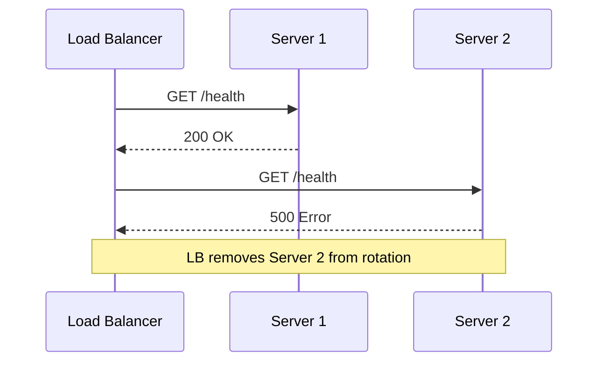
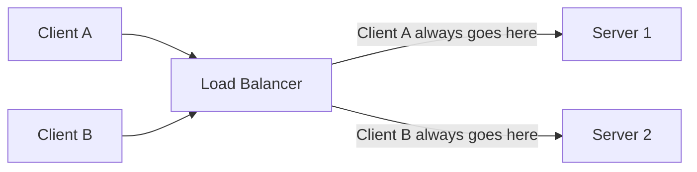

# Load Balancer

A load balancer sits between clients and backend servers. It receives incoming
traffic and forwards each request or connection to a healthy backend.

## Why We Need It

Without a load balancer, clients connect directly to one server. That creates a
few problems:

- One server can become overloaded.
- A server failure can make the whole application unavailable.
- Scaling requires clients to know about new servers.
- Deployments become risky because traffic is tied to specific machines.

A load balancer helps with:

- **Scalability:** distribute traffic across many servers.
- **Availability:** stop sending traffic to unhealthy servers.
- **Fault tolerance:** keep the system working when one backend fails.
- **Operational flexibility:** add, remove, or deploy servers behind one stable endpoint.

## L4 vs L7 Load Balancing

Load balancers commonly work at Layer 4 or Layer 7 of the OSI model.

| Type | Layer | Uses | Can Inspect | Example Decision |
| --- | --- | --- | --- | --- |
| L4 | Transport | TCP/UDP | IP, port, protocol | Send TCP connection to server 2 |
| L7 | Application | HTTP/HTTPS/gRPC | URL, headers, cookies, method, body metadata | Send `/api/payments` to payment service |

### L4 Load Balancer

An L4 load balancer routes connections based on network-level information.

It is usually faster because it does not need to understand the application
request.

Use L4 when:

- You need very high performance.
- You are balancing TCP or UDP traffic.
- You do not need request-aware routing.

### L7 Load Balancer

An L7 load balancer understands application protocols such as HTTP.

It can make smarter routing decisions based on request data.

Use L7 when:

- You need path-based or host-based routing.
- You need header, cookie, or method-based routing.
- You want TLS termination at the load balancer.
- You want application-aware observability or rate limiting.

## Round Robin

Round Robin sends requests to servers in order.

Example with three servers:

1. Request 1 goes to server 1.
2. Request 2 goes to server 2.
3. Request 3 goes to server 3.
4. Request 4 goes back to server 1.

Pros:

- Simple.
- Easy to understand.
- Works well when servers have similar capacity and requests have similar cost.

Cons:

- Does not account for slow or overloaded servers.
- Does not account for heavy requests.

## Least Connections

Least Connections sends the next request to the server with the fewest active
connections.

This is better when requests have different durations.

Pros:

- Handles uneven request duration better than Round Robin.
- Helps avoid sending more work to already busy servers.

Cons:

- Requires tracking active connections.
- Active connections do not always equal actual CPU or memory load.

## Health Checks

Health checks help the load balancer decide which servers can receive traffic.

A health check can be:

- **TCP check:** can the load balancer open a connection?
- **HTTP check:** does `/health` return a successful response?
- **Application check:** are dependencies like database/cache reachable?

Important settings:

- **Interval:** how often to check.
- **Timeout:** how long to wait for a response.
- **Healthy threshold:** how many successes before adding a server back.
- **Unhealthy threshold:** how many failures before removing a server.

## Sticky Sessions

Sticky sessions send the same client to the same backend server across multiple
requests.

This is useful when session state is stored locally on a server.

Sticky sessions can be implemented using:

- Source IP address.
- Cookies.
- Session IDs.

Pros:

- Useful for legacy applications that keep session state in memory.
- Can reduce repeated cache warming for the same user.

Cons:

- Uneven traffic distribution.
- Harder failover when a server dies.
- Makes horizontal scaling less clean.

Prefer storing session state in a shared system such as Redis, a database, or a
stateless signed token when possible.

## Common Load Balancer Features

- **TLS termination:** decrypt HTTPS at the load balancer.
- **Rate limiting:** protect services from excessive requests.
- **Request routing:** route by host, path, header, or method.
- **Retries:** retry failed requests when safe.
- **Connection pooling:** reuse backend connections efficiently.
- **Observability:** collect metrics, logs, and traces.

## Quick Interview Summary

Use a load balancer to distribute traffic, improve availability, and hide backend
server changes from clients.

L4 load balancing is faster and works at the connection level. L7 load balancing
is smarter and works at the request level.

Round Robin is simple but does not consider server load. Least Connections is
better when requests have different durations. Health checks prevent traffic from
going to unhealthy servers. Sticky sessions keep a user on the same backend, but
they can hurt scalability and failover.

## Things To Remember

- A load balancer should only send traffic to healthy servers.
- L4 routes connections; L7 routes requests.
- Round Robin assumes servers and requests are roughly equal.
- Least Connections adapts better to long-running requests.
- Sticky sessions are sometimes useful, but stateless services scale better.
