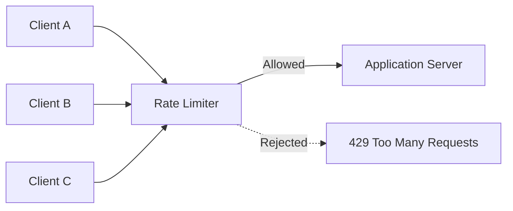
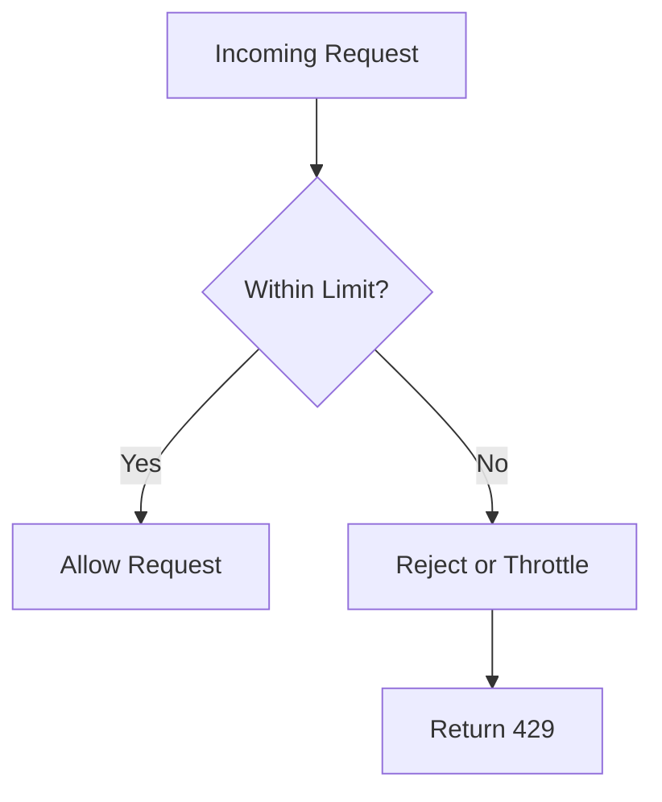
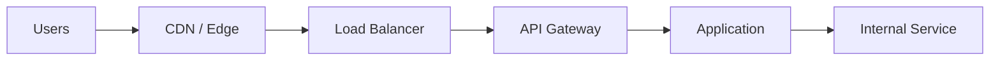
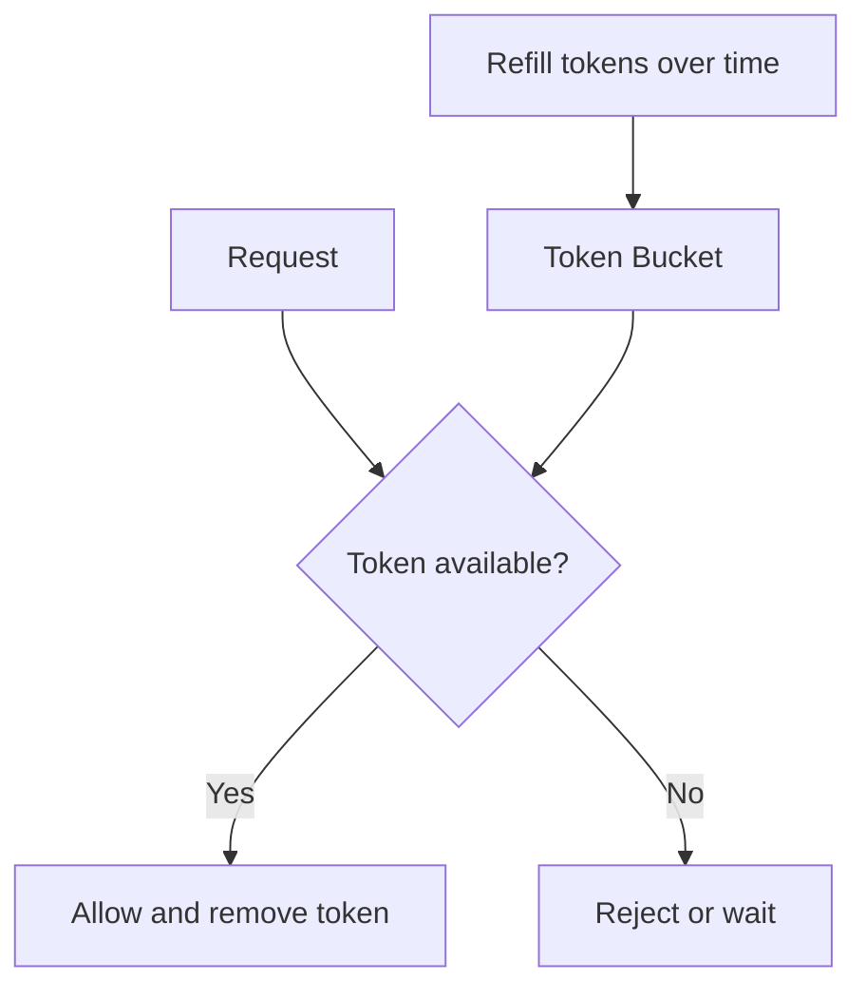
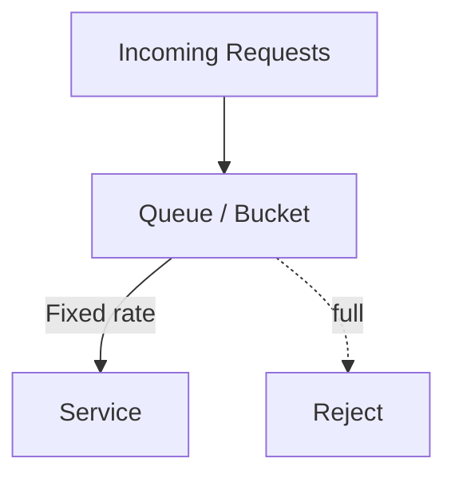
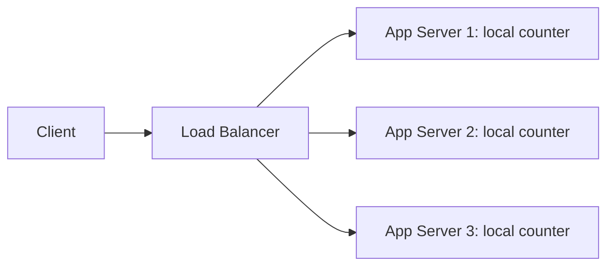
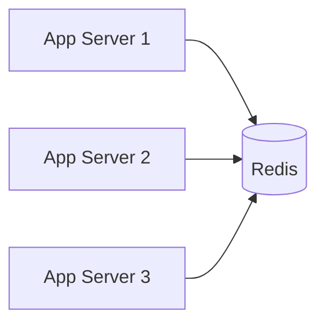
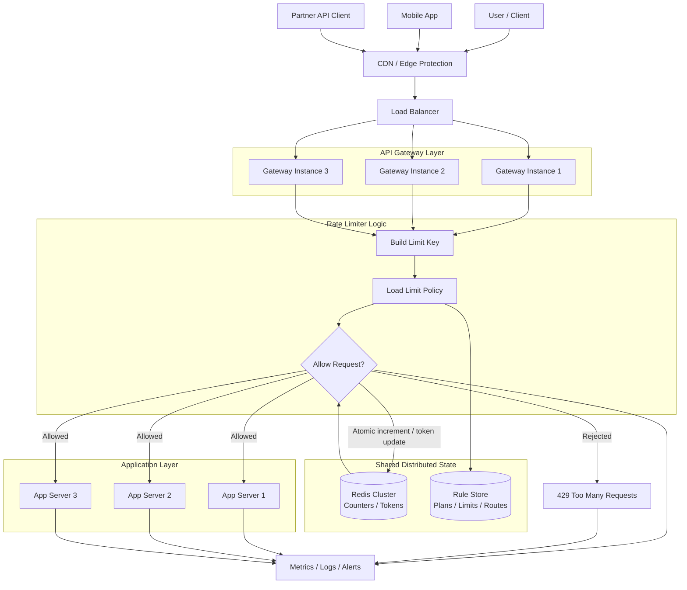

# Rate Limiter

A rate limiter controls how many requests a client, user, IP address, API key,
or service can make in a given amount of time.

It protects a system from overload, abuse, accidental traffic spikes, and noisy
clients.



## Why We Need It

Without rate limiting, one client can consume too much capacity and affect
everyone else.

Common problems:

- A buggy client sends too many retries.
- A user repeatedly calls an expensive endpoint.
- A bot scrapes or abuses public APIs.
- A sudden traffic spike overloads application servers.
- Downstream services such as databases or third-party APIs get overwhelmed.

A rate limiter helps with:

- **Availability:** keep the system responsive during spikes.
- **Fairness:** prevent one client from using all capacity.
- **Cost control:** reduce unnecessary compute, database, and API usage.
- **Abuse prevention:** slow down bots, brute-force attempts, and scraping.
- **Backpressure:** reject or delay traffic before the whole system fails.



## Where Rate Limiters Sit

Rate limiting can happen at different layers.



Common placements:

- **CDN or edge:** block abusive traffic before it reaches your infrastructure.
- **Load balancer:** enforce coarse limits near traffic entry.
- **API gateway:** enforce user, API key, route, or tenant-level limits.
- **Application:** apply business-specific rules.
- **Internal service:** protect expensive dependencies from other services.

Production systems often use multiple rate limiters at different layers.

## What To Limit By

The limiter needs a key that identifies the caller or resource.

Common keys:

| Key | Use When |
| --- | --- |
| IP address | Anonymous public traffic |
| User ID | Logged-in users |
| API key | Public developer APIs |
| Tenant ID | SaaS customer isolation |
| Route/path | Expensive endpoints need stricter limits |
| Service name | Internal service-to-service limits |
| Combination | Example: `user_id + endpoint` |

Choosing the wrong key can make limits too strict or too weak. For example, IP
limits can unfairly group many users behind the same NAT, while user limits do
not help before login.

## Fixed Window

Fixed Window allows a fixed number of requests in a fixed time period.

Example:

- Limit: 3 requests per second.
- Window: `12:00:00` to `12:00:01`.
- First 3 requests are allowed.
- Extra requests in that same window are rejected.
- At the next window, the counter resets.


Pros:

- Very simple.
- Easy to implement.
- Efficient storage: one counter per key per window.

Cons:

- Boundary bursts are possible.
- Traffic can be uneven around window edges.

Boundary burst example:

```text
Allowed: 100 requests from 12:00:59.900 to 12:01:00.000
Allowed: 100 requests from 12:01:00.000 to 12:01:00.100
```

Even with a limit of 100 requests per minute, the system may receive 200
requests in a very short time around the boundary.

## Token Bucket

Token Bucket stores tokens in a bucket. Each request consumes one token. Tokens
are refilled at a steady rate up to a maximum bucket size.



Pros:

- Allows short bursts.
- Smooths traffic over time.
- Common for API rate limiting.

Cons:

- Slightly more complex than fixed window.
- Needs careful refill calculation.

Use Token Bucket when occasional bursts are acceptable but sustained traffic
must stay within a rate.

## Leaky Bucket

Leaky Bucket processes requests at a steady rate. Incoming requests enter a
queue, and the bucket leaks at a fixed speed.



Pros:

- Produces a steady output rate.
- Good when downstream systems need smooth traffic.

Cons:

- Can add latency because requests may wait in a queue.
- Requests are rejected when the queue is full.

Use Leaky Bucket when you want strict smoothing rather than burst allowance.

## Sliding Window Log

Sliding Window Log stores timestamps for each request and removes timestamps
outside the current window.

Example:

- Limit: 100 requests per minute.
- Store timestamps for recent requests.
- Count how many timestamps are within the last 60 seconds.
- Allow only if the count is less than 100.

Pros:

- Accurate.
- Avoids fixed-window boundary bursts.

Cons:

- More memory usage.
- More expensive for high-cardinality traffic.

Use Sliding Window Log when accuracy matters more than storage efficiency.

## Sliding Window Counter

Sliding Window Counter approximates a sliding window using counters from the
current and previous windows.

It estimates the request count based on how much of the previous window still
overlaps with the current sliding window.

Pros:

- More accurate than fixed window.
- More memory efficient than sliding window log.

Cons:

- Approximate, not exact.
- Slightly more complex math.

Use Sliding Window Counter for a good balance between accuracy and efficiency.

## Algorithm Comparison

| Algorithm | Accuracy | Burst Handling | Storage | Best For |
| --- | --- | --- | --- | --- |
| Fixed Window | Low around boundaries | Can burst at edges | Low | Simple limits |
| Token Bucket | Medium | Allows controlled bursts | Low | Public APIs |
| Leaky Bucket | Medium | Smooths bursts | Queue size | Protecting downstream systems |
| Sliding Window Log | High | Good | Higher | Strict limits |
| Sliding Window Counter | Medium-high | Good | Low | Scalable approximate limits |

## Rejection Behavior

When a request exceeds the limit, common behavior is to return HTTP `429 Too
Many Requests`.

Useful headers:

| Header | Meaning |
| --- | --- |
| `Retry-After` | When the client should retry |
| `X-RateLimit-Limit` | Maximum allowed requests |
| `X-RateLimit-Remaining` | Remaining requests in the current window |
| `X-RateLimit-Reset` | When the limit resets |

Example response:

```text
HTTP/1.1 429 Too Many Requests
Retry-After: 30
X-RateLimit-Limit: 100
X-RateLimit-Remaining: 0
X-RateLimit-Reset: 1710000030
```

## Distributed Rate Limiting

Rate limiting is harder when traffic is handled by many servers.

If each application server keeps its own local counter, the real global limit
can be exceeded.



For global limits, counters usually need shared storage.



### Distributed System Design

In a distributed system, the rate limiter is usually placed before the
application servers, often inside an API gateway or a dedicated rate limiter
service. All gateway instances use a shared fast store, such as Redis, so the
limit is enforced globally instead of per machine.



Typical request flow:

1. Client sends a request.
2. CDN or edge layer blocks obvious abusive traffic.
3. Load balancer sends the request to an API gateway instance.
4. Gateway builds a limit key such as `user_id + route`.
5. Gateway loads the matching rate limit rule.
6. Gateway updates Redis atomically to check the current counter or token count.
7. If allowed, the request goes to the application.
8. If rejected, the gateway returns `429 Too Many Requests`.
9. Metrics and logs record the decision for debugging and alerting.

Common shared stores:

- Redis.
- Memcached.
- DynamoDB or other key-value stores.
- Purpose-built gateway or service mesh rate limiters.

Important distributed concerns:

- Atomic counter updates.
- Expiration for old windows.
- Clock skew between servers.
- Hot keys for very popular users or tenants.
- Store availability and latency.
- Fail-open vs fail-closed behavior.

## Fail-Open vs Fail-Closed

If the rate limiter's shared store is unavailable, the system must decide what
to do.

| Mode | Meaning | Tradeoff |
| --- | --- | --- |
| Fail-open | Allow requests when limiter is unavailable | Better availability, weaker protection |
| Fail-closed | Reject requests when limiter is unavailable | Strong protection, worse availability |

Public user-facing systems often fail-open for availability. Security-sensitive
or expensive endpoints may fail-closed.

## Rate Limiting vs Throttling vs Quotas

These terms are related but not identical.

| Concept | Meaning |
| --- | --- |
| Rate limiting | Reject or delay requests above a short-term limit |
| Throttling | Slow down requests instead of immediately rejecting |
| Quota | Long-term allowance, such as 1 million requests per month |

An API platform may use all three:

- 100 requests per second rate limit.
- Slower processing after 80% usage.
- 1 million requests per month quota.

## Metrics To Watch

Important rate limiter metrics:

- Allowed request count.
- Rejected request count.
- Rejection rate by route, user, IP, API key, or tenant.
- Current counter or token usage.
- Shared store latency.
- Shared store errors.
- Hot keys.
- `429` response rate.
- Retry-after distribution.

Important logs:

- Limit key.
- Request path and method.
- Limit rule that matched.
- Allowed or rejected decision.
- Remaining tokens or count.
- Trace/request ID.

## Java Example

Current source:

- `src/java/rate-limiter/SimpleFixedWindowRateLimiter.java`

The example demonstrates a simple fixed-window limiter:

- `maxRequests` controls how many requests are allowed per window.
- `windowSizeInMillis` controls the window duration.
- `allowRequest()` returns `true` when the request is allowed.
- `allowRequest()` returns `false` when the limit is exceeded.

Run it with:

```bash
javac src/java/rate-limiter/SimpleFixedWindowRateLimiter.java
java -cp src/java/rate-limiter SimpleFixedWindowRateLimiter
```

## Design Checklist

When designing a system with rate limiting, ask:

- What are we protecting: app servers, databases, third-party APIs, or users?
- Where should the limiter run: edge, gateway, app, or internal service?
- What is the limit key: IP, user, API key, tenant, route, or a combination?
- What algorithm fits the traffic shape?
- Should bursts be allowed?
- Should excess requests be rejected or delayed?
- What status code and headers should clients receive?
- Do limits need to be global across many servers?
- What shared store is needed for distributed counters?
- Should the system fail-open or fail-closed?
- What metrics and logs are needed for debugging?

## Example Interview Answer

If asked "How would you add rate limiting to this system?", a strong answer
could be:

> I would add rate limiting at the API gateway so limits are enforced before
> requests reach the application. For authenticated APIs, I would key limits by
> user ID or API key, and for anonymous traffic I would start with IP-based
> limits. A token bucket works well for public APIs because it allows short
> bursts while controlling sustained traffic. If the application runs on many
> servers, I would store counters or tokens in Redis using atomic operations and
> expirations. Exceeded requests should return `429 Too Many Requests` with
> `Retry-After` and rate-limit headers. I would monitor allowed requests,
> rejected requests, Redis latency, and hot keys.

## Quick Summary

Use a rate limiter to protect services from too much traffic from one client,
user, tenant, API key, or route.

Fixed Window is simple but can allow boundary bursts. Token Bucket allows
controlled bursts. Leaky Bucket smooths traffic. Sliding Window Log is accurate
but uses more memory. Sliding Window Counter balances accuracy and efficiency.

Distributed rate limiting usually needs shared storage such as Redis so limits
are enforced globally across servers.

## Things To Remember

- Rate limiters protect availability, fairness, and cost.
- Pick the right key: IP, user, API key, tenant, route, or combination.
- Fixed Window is the easiest algorithm to start with.
- Token Bucket is common for APIs because it handles bursts well.
- Sliding Window algorithms reduce fixed-window boundary problems.
- Distributed limits need atomic shared counters.
- Use `429 Too Many Requests` for rejected HTTP requests.
- Include `Retry-After` when clients should wait before retrying.
- Decide whether the limiter should fail-open or fail-closed.
- Watch rejected request rate, hot keys, and shared store latency.
