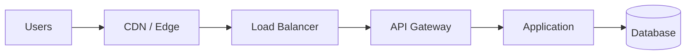
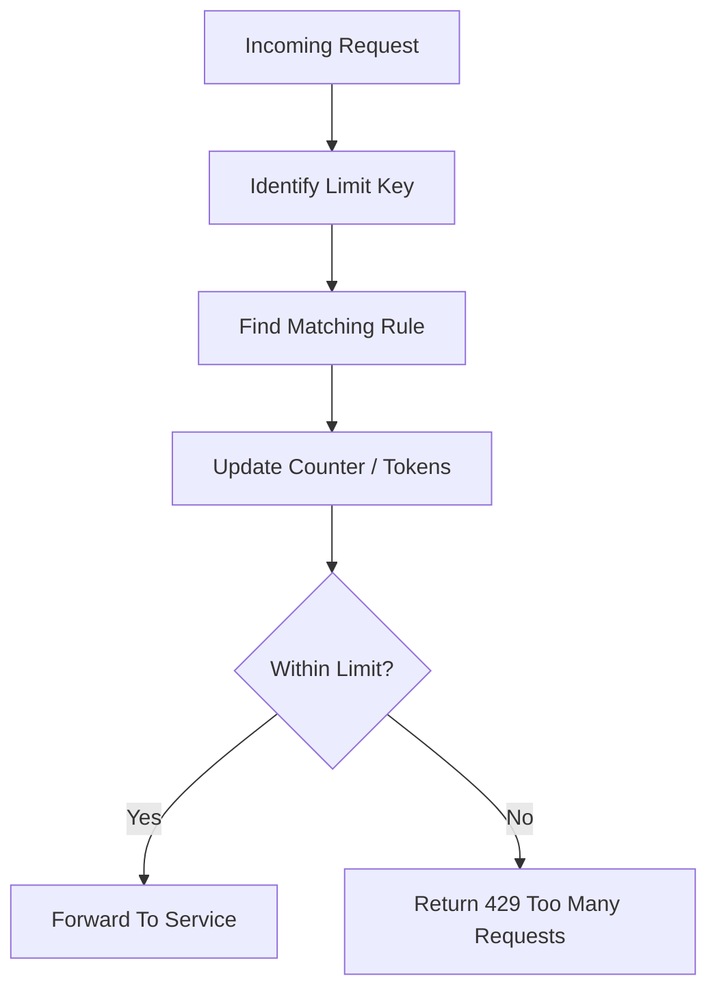
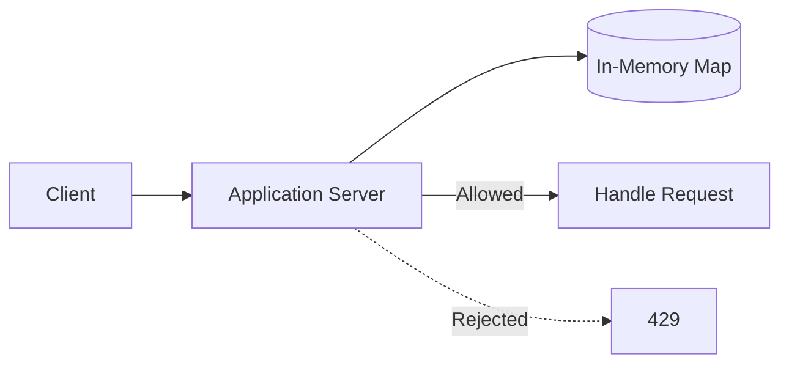
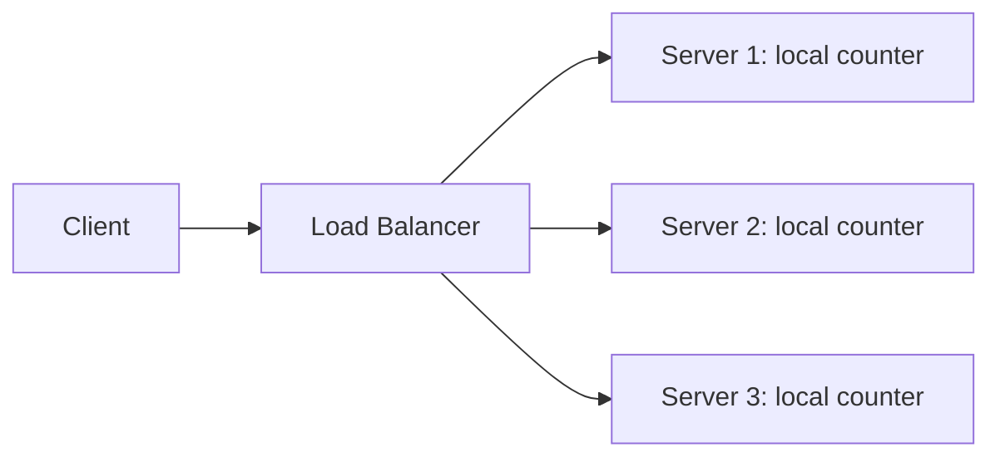
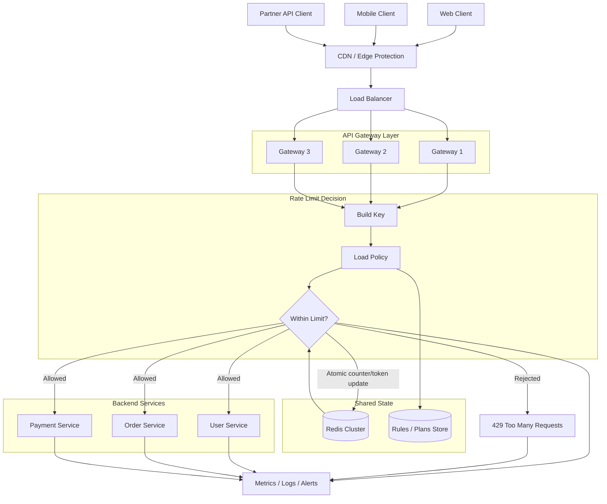
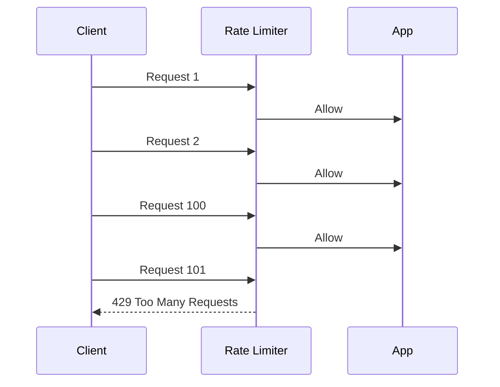
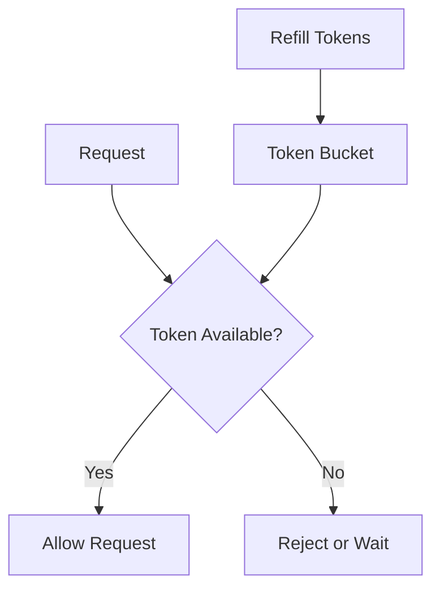
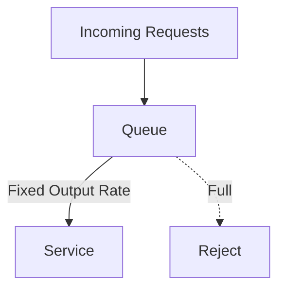

# Rate Limiter

A rate limiter controls how many requests a client can make in a given time
period. The client can be an IP address, user, API key, tenant, device, or
internal service.

In an interview, do not start with algorithms immediately. Start with the
problem: what are we protecting, who are we limiting, where should the decision
be made, and what should happen when the limit is exceeded.

## Interview Flow

A clean way to explain rate limiter design:

1. Clarify requirements.
2. Define what is being limited.
3. Decide where the rate limiter sits.
4. Decide the limit key.
5. Define request behavior for allowed and rejected requests.
6. Design the distributed architecture.
7. Choose storage and atomic update strategy.
8. Discuss failure handling.
9. Compare algorithms and choose one.
10. Discuss metrics and operational concerns.

This flow keeps the answer grounded. Algorithms come after we understand the
system constraints.

## 1. Clarify Requirements

Before designing, ask what kind of limit is needed.

Useful questions:

- Are we limiting anonymous users, logged-in users, API keys, tenants, or
  internal services?
- Is the limit global across all servers or local to one server?
- Should the system reject requests or delay them?
- Are short bursts allowed?
- Is strict accuracy required, or is approximate limiting acceptable?
- What response should clients receive after crossing the limit?
- Is this protecting an application, a database, a third-party API, login, or a
  public API?

Example requirement:

```text
Allow each API key to make 100 requests per minute.
If the key exceeds the limit, return HTTP 429 Too Many Requests.
The limit must work globally across all API gateway instances.
```

## 2. Why We Need Rate Limiting

Without rate limiting, one client can consume too much capacity and hurt other
users.

Common problems:

- A buggy client retries too aggressively.
- A user repeatedly calls an expensive endpoint.
- A bot scrapes public APIs.
- Login endpoints receive brute-force attempts.
- A tenant in a SaaS system consumes more than its fair share.
- Downstream services such as databases or third-party APIs get overwhelmed.

A rate limiter helps with:

- **Availability:** keep the system responsive during spikes.
- **Fairness:** prevent one client from consuming all capacity.
- **Cost control:** reduce unnecessary compute, database, and external API usage.
- **Abuse prevention:** slow down scraping, brute force, and spam.
- **Backpressure:** reject traffic before the entire system fails.

## 3. What We Limit

The rate limiter needs a key. The key decides whose usage is counted.

| Key | Example | Use When |
| --- | --- | --- |
| IP address | `203.0.113.10` | Anonymous traffic before login |
| User ID | `user_123` | Logged-in product usage |
| API key | `api_key_abc` | Developer APIs |
| Tenant ID | `tenant_42` | SaaS customer isolation |
| Route | `/login` | Endpoint-specific protection |
| Service name | `payment-service` | Internal service-to-service limits |
| Combination | `user_123:/orders` | Per-user per-endpoint limits |

Choosing the key matters. IP-based limits are useful before authentication, but
they can be unfair when many users share one NAT or office network. User ID or
API-key limits are better after authentication. Endpoint-level limits are useful
when one route is much more expensive than others.

## 4. Where The Rate Limiter Sits

Rate limiting can happen at multiple layers.



Common placements:

| Placement | What It Protects | Notes |
| --- | --- | --- |
| CDN / edge | Infrastructure from obvious abusive traffic | Good for IP-level rules |
| Load balancer | Backend fleet from coarse traffic spikes | Usually not business-aware |
| API gateway | APIs by user, API key, route, or tenant | Common place for rate limiting |
| Application | Business-specific limits | Knows user and domain context |
| Internal service | Expensive downstream dependency | Protects databases, queues, third-party APIs |

In many designs, the API gateway is the best primary place because it sees all
API traffic before it reaches application servers and can apply route/user/API
key policies.

## 5. Request Behavior

For every request, the limiter decides:



When a request is allowed, it continues to the backend service.

When a request is rejected, HTTP APIs usually return `429 Too Many Requests`.
Useful headers:

| Header | Meaning |
| --- | --- |
| `Retry-After` | How long the client should wait before retrying |
| `X-RateLimit-Limit` | Maximum allowed requests |
| `X-RateLimit-Remaining` | Remaining requests in the current window |
| `X-RateLimit-Reset` | When the limit resets |

Example:

```text
HTTP/1.1 429 Too Many Requests
Retry-After: 30
X-RateLimit-Limit: 100
X-RateLimit-Remaining: 0
X-RateLimit-Reset: 1710000030
```

## 6. Single-Server Design

For one server, rate limiting can be kept in memory.



The in-memory map can store:

```text
key -> counter, window_start_time
```

This is simple and fast, but it only works correctly when all traffic for a key
goes to the same server. In a real distributed system, traffic is spread across
many instances, so local counters are usually not enough.

## 7. Distributed System Design

In a distributed system, multiple gateway or application instances process
requests. If each instance keeps its own local counter, a client can exceed the
real global limit by hitting different instances.

Bad design:



Better design: all rate limiter instances use shared state.



Request flow:

1. Client sends request.
2. CDN or edge blocks simple abusive traffic when possible.
3. Load balancer forwards request to an API gateway instance.
4. Gateway identifies the caller and route.
5. Gateway builds a key such as `api_key + route`.
6. Gateway loads the matching policy, such as `100 requests/minute`.
7. Gateway updates shared state atomically.
8. If the request is within the limit, it goes to the backend.
9. If the request exceeds the limit, gateway returns `429`.
10. Metrics and logs record the decision.

## 8. Storage Design

For distributed rate limiting, the shared store must support fast atomic updates.

Common choices:

| Store | Use When | Notes |
| --- | --- | --- |
| Redis | Low-latency counters or token state | Common choice because of atomic operations and TTL |
| Memcached | Simple distributed counters | Less flexible than Redis |
| DynamoDB or key-value DB | Very large scale with durable state | Higher latency than Redis |
| Gateway built-in storage | Managed API gateway limits | Less custom logic |

For a fixed-window limiter, Redis state may look like:

```text
rate_limit:{api_key}:{route}:{window_start} -> count
TTL -> window size
```

The update must be atomic. For example, increment the counter and set expiry as
one logical operation. If two requests arrive at the same time, both must not
read the same old value and incorrectly pass.

Important storage concerns:

- Use TTL so old keys disappear automatically.
- Avoid very hot keys when one tenant or route has huge traffic.
- Keep the rate limiter store highly available.
- Keep the operation small because it happens on every request.
- Consider local caching for rules, not for global counters.

## 9. Failure Handling

The rate limiter itself can fail. The shared store can become slow or
unavailable, and the system must choose a policy.

| Mode | Meaning | Tradeoff |
| --- | --- | --- |
| Fail-open | Allow requests when limiter cannot decide | Better availability, weaker protection |
| Fail-closed | Reject requests when limiter cannot decide | Stronger protection, worse availability |

For normal user-facing APIs, fail-open is often chosen to avoid taking the whole
product down because the limiter is unavailable. For login abuse prevention,
payments, expensive endpoints, or strict partner quotas, fail-closed may be more
appropriate.

Other failure concerns:

- Redis latency can add latency to every request.
- Clock differences can affect time-window calculations.
- A retry storm can increase rejected and allowed traffic.
- Bad configuration can accidentally block real users.
- A single global key can become a bottleneck.

## 10. Algorithms

Now that the system shape is clear, choose the algorithm.

### Fixed Window

Fixed Window allows a fixed number of requests in a fixed time period.

Example:

```text
Limit: 100 requests per minute
Window: 12:00:00 to 12:00:59
```

The counter resets when the next minute starts.



Pros:

- Simple to understand.
- Easy to implement.
- Low memory usage.
- Works well for basic limits.

Cons:

- Boundary bursts are possible.

Boundary burst:

```text
100 requests at 12:00:59
100 requests at 12:01:00
```

That is technically valid, but it allows 200 requests in a very short interval.

### Sliding Window Log

Sliding Window Log stores timestamps of recent requests for each key.

For every request:

1. Remove timestamps older than the window.
2. Count the remaining timestamps.
3. Allow only if count is below the limit.
4. Store the new timestamp if allowed.

Pros:

- Very accurate.
- Avoids fixed-window boundary bursts.

Cons:

- Higher memory usage.
- More expensive when many users send many requests.

Use it when strict accuracy matters and traffic volume is manageable.

### Sliding Window Counter

Sliding Window Counter approximates sliding behavior using the previous and
current fixed windows.

It estimates how much traffic from the previous window still overlaps with the
current rolling window.

Pros:

- More accurate than fixed window.
- Lower memory than sliding window log.
- Good balance for large-scale systems.

Cons:

- Approximate, not exact.
- More complex than fixed window.

Use it when you need better fairness than fixed window but cannot store every
request timestamp.

### Token Bucket

Token Bucket has a bucket with a maximum capacity. Tokens refill over time. Each
request consumes one token.



Example:

```text
Refill rate: 10 tokens/second
Bucket size: 50 tokens
```

This allows a short burst of up to 50 requests, but long-term traffic is limited
to about 10 requests per second.

Pros:

- Allows controlled bursts.
- Good for public APIs and user actions.
- Smooths sustained usage without being too strict.

Cons:

- Needs careful refill math.
- Slightly more complex state than fixed window.

### Leaky Bucket

Leaky Bucket accepts requests into a queue and processes them at a fixed rate.
If the queue is full, new requests are rejected.



Pros:

- Smooths traffic to a steady output rate.
- Useful when downstream systems cannot handle bursts.

Cons:

- Can add queueing latency.
- Queue management is required.
- Requests may wait before being processed.

Use it when a downstream service needs a steady flow, not bursty traffic.

## Algorithm Comparison

| Algorithm | Accuracy | Burst Support | Memory | Main Tradeoff |
| --- | --- | --- | --- | --- |
| Fixed Window | Low near boundaries | Allows boundary bursts | Low | Simplest, but less fair |
| Sliding Window Log | High | Controls bursts well | High | Accurate, but expensive |
| Sliding Window Counter | Medium-high | Controls bursts reasonably | Low | Scalable approximation |
| Token Bucket | Medium | Allows controlled bursts | Low | Great for burst-friendly APIs |
| Leaky Bucket | Medium | Smooths bursts into steady flow | Queue size | Adds latency but protects downstream |

## When To Use Which Algorithm

| Use Case | Good Choice | Why |
| --- | --- | --- |
| Simple endpoint protection | Fixed Window | Easy to implement and reason about |
| Public API with normal short bursts | Token Bucket | Lets clients burst briefly while enforcing long-term rate |
| Strict fairness for low/medium traffic | Sliding Window Log | Most accurate rolling-window behavior |
| Large-scale API gateway limits | Sliding Window Counter | Better fairness than fixed window with low memory |
| Protecting a fragile downstream service | Leaky Bucket | Sends traffic at a steady rate |
| Login or password reset protection | Sliding Window Log or Sliding Window Counter | Reduces abuse over a rolling time window |
| Costly third-party API calls | Token Bucket or Leaky Bucket | Controls spend and shields dependency |

## Real Examples

These examples describe common real-world usage patterns, not claims about a
specific company's internal implementation.

| Scenario | Common Algorithm Fit | Reason |
| --- | --- | --- |
| API product with developer keys | Token Bucket | Developers may send small bursts, but sustained usage must stay within plan limits |
| Login endpoint | Sliding Window Log or Counter | Brute-force attempts should be limited over a rolling period |
| SMS or email sending | Token Bucket | Allows normal short activity bursts while controlling abuse and cost |
| Payment creation endpoint | Fixed Window or Sliding Window Counter | Protects expensive and sensitive operations |
| Background jobs calling a downstream API | Leaky Bucket | Prevents sudden bursts from overwhelming the dependency |
| Free vs paid SaaS plans | Token Bucket with per-plan bucket sizes | Paid plans can have larger capacity and refill rates |

## Rate Limiting vs Throttling vs Quotas

| Concept | Meaning |
| --- | --- |
| Rate limiting | Reject or delay requests above a short-term limit |
| Throttling | Slow down requests instead of immediately rejecting |
| Quota | Long-term allowance, such as requests per day or month |

An API platform may use all three:

- 100 requests per second rate limit.
- Slower processing after high usage.
- 1 million requests per month quota.

## Metrics To Watch

Important metrics:

- Allowed request count.
- Rejected request count.
- Rejection rate by route, user, IP, API key, or tenant.
- Latency added by the rate limiter.
- Redis or shared-store latency.
- Redis or shared-store errors.
- Hot keys.
- `429` response rate.
- Retry-after distribution.

Important logs:

- Limit key.
- Request path and method.
- Matched rule.
- Allowed or rejected decision.
- Remaining tokens or counter value.
- Trace/request ID.

## Java Example

Current source:

- `src/java/rate-limiter/SimpleFixedWindowRateLimiter.java`

The example demonstrates a simple fixed-window limiter:

- `maxRequests` controls how many requests are allowed per window.
- `windowSizeInMillis` controls the window duration.
- `allowRequest()` returns `true` when the request is allowed.
- `allowRequest()` returns `false` when the limit is exceeded.

Run it with:

```bash
javac src/java/rate-limiter/SimpleFixedWindowRateLimiter.java
java -cp src/java/rate-limiter SimpleFixedWindowRateLimiter
```

## Example Interview Answer

If asked "Design a rate limiter", a strong answer could be:

> I would first clarify what we are limiting: IP, user ID, API key, tenant, or
> endpoint. For a public API, I would put the limiter at the API gateway so
> traffic is checked before reaching application servers. The gateway would
> build a key such as `api_key + route`, load the matching plan or route policy,
> and update shared state in Redis using an atomic operation. If the request is
> allowed, it goes to the backend. If not, the gateway returns `429 Too Many
> Requests` with `Retry-After` and rate-limit headers. For the algorithm, I
> would choose Token Bucket if short bursts are acceptable, Sliding Window
> Counter if fairness over a rolling window matters at scale, or Sliding Window
> Log if strict accuracy is required for lower-volume sensitive endpoints. I
> would monitor allowed requests, rejected requests, Redis latency, hot keys, and
> 429 rates.

## Things To Remember

- Start with requirements before algorithms.
- Decide the limit key carefully.
- API gateway is a common place for distributed API rate limiting.
- Distributed limits need shared state or a managed gateway/service.
- Shared counter updates must be atomic.
- Fixed Window is simple but has boundary bursts.
- Token Bucket is good when controlled bursts are acceptable.
- Sliding Window Log is accurate but uses more memory.
- Sliding Window Counter is a scalable compromise.
- Leaky Bucket is useful when the output rate must be steady.
- Rejected HTTP requests usually return `429 Too Many Requests`.
- Always monitor rejection rate, store latency, and hot keys.
