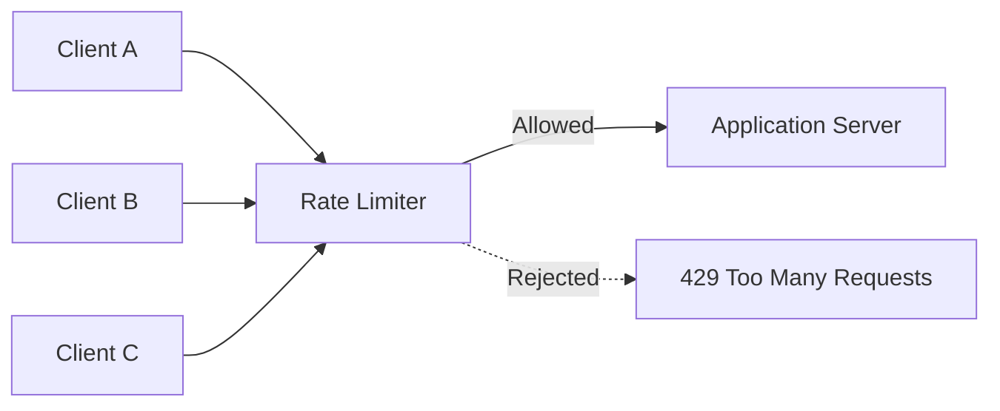
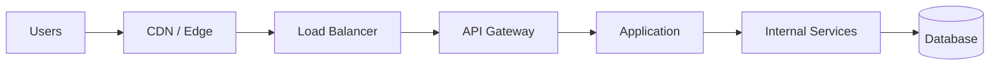
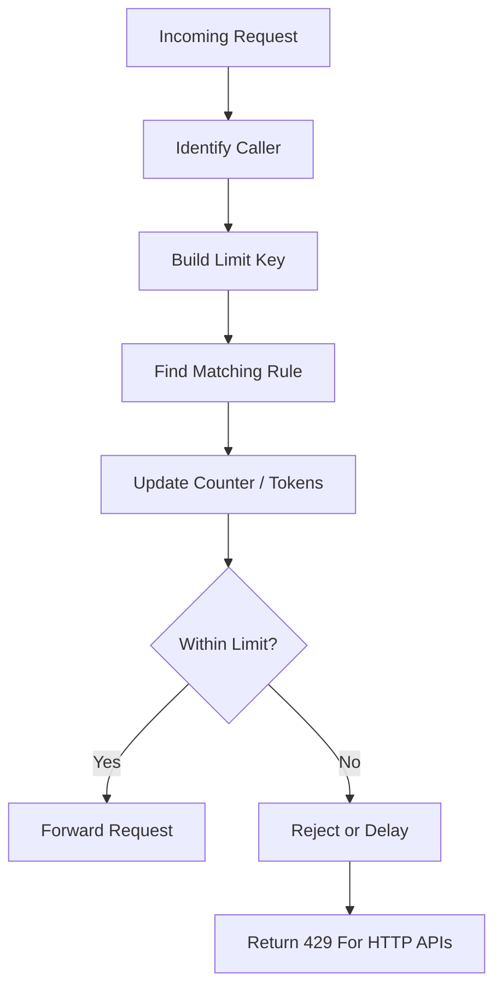
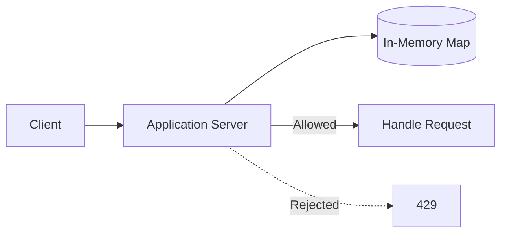
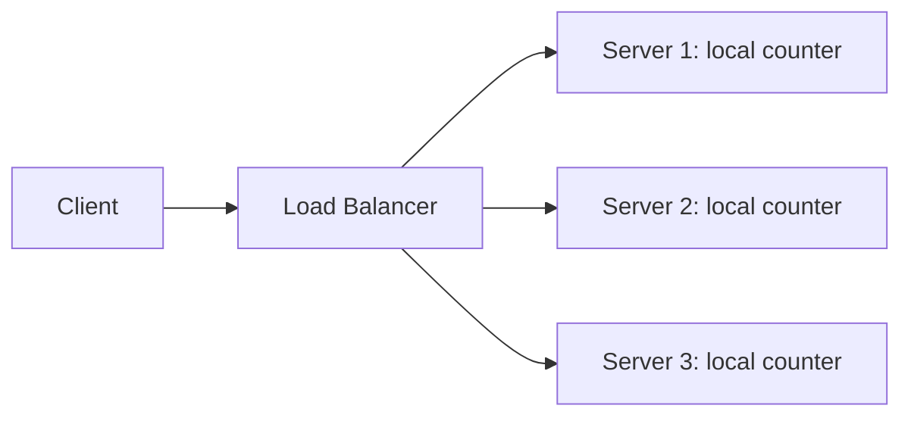
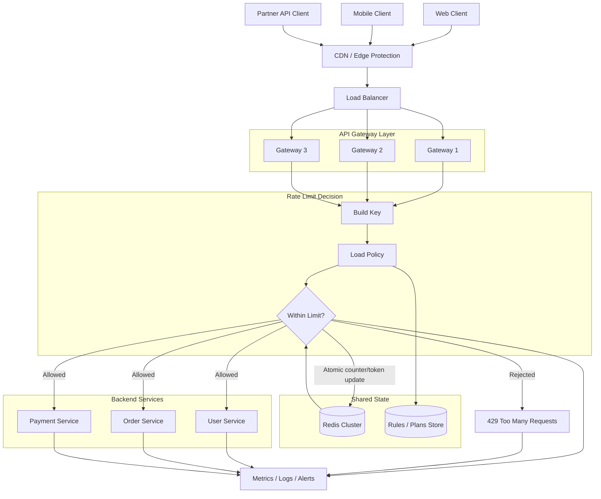
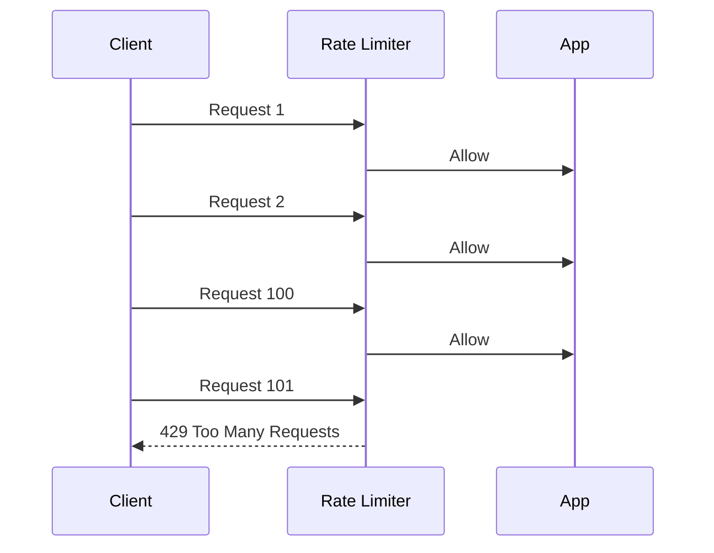
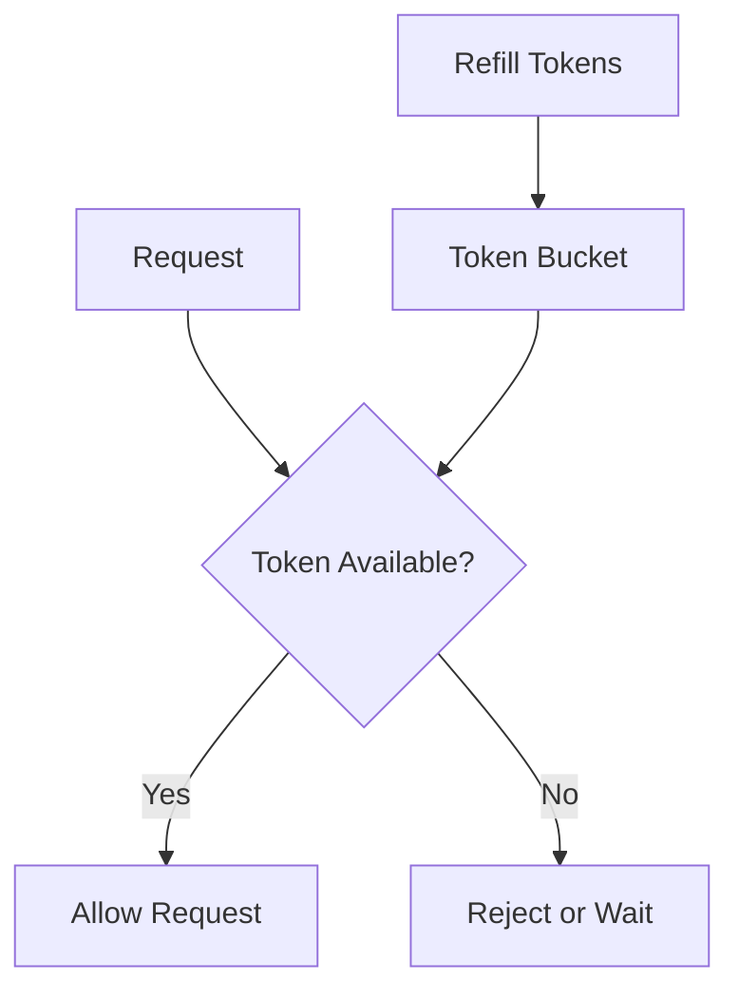
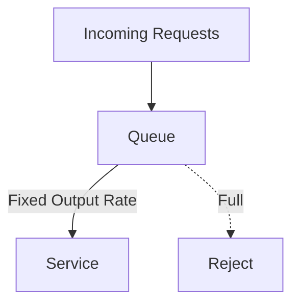

# Rate Limiter

A rate limiter controls how many requests a client, user, IP address, API key,
tenant, device, or service can make in a given amount of time.

It sits in the request path and decides whether a request should be allowed,
rejected, or delayed. The main goal is to protect the system from overload,
abuse, accidental traffic spikes, and unfair usage.



## Why We Need It

Without rate limiting, one caller can consume too much capacity and hurt other
users.

Common problems:

- A buggy client retries too aggressively.
- A user repeatedly calls an expensive endpoint.
- A bot scrapes public APIs.
- Login endpoints receive brute-force attempts.
- A tenant in a SaaS system consumes more than its fair share.
- A downstream service such as a database or third-party API gets overwhelmed.

A rate limiter helps with:

- **Availability:** keep the service responsive during traffic spikes.
- **Fairness:** stop one caller from consuming all shared capacity.
- **Cost control:** reduce unnecessary compute, database, and external API usage.
- **Abuse prevention:** slow down scraping, brute force, spam, and automation.
- **Backpressure:** reject traffic early before the whole system degrades.

## Start With Requirements

Before choosing an algorithm, first define the rule the system must enforce.

Important questions:

- Who is being limited: IP, user, API key, tenant, device, or service?
- Is the limit global across all servers?
- Is the limit per route, per user, per tenant, or a combination?
- Should short bursts be allowed?
- Should extra requests be rejected immediately or delayed?
- How accurate does the limit need to be?
- What should the client receive when the limit is crossed?
- Which system are we protecting: application servers, login, database, queue,
  payment service, email provider, or third-party API?

Example requirements:

```text
Allow each API key to make 100 requests per minute.
Allow each user to attempt login 5 times per minute.
Allow each tenant to send 10,000 requests per hour.
Allow the order service to call the payment service 500 times per second.
```

These are different problems. They may need different keys, placements, storage,
and algorithms.

## What To Limit By

The limiter needs a key. The key decides whose usage is counted.

| Key | Example | Use When |
| --- | --- | --- |
| IP address | `203.0.113.10` | Anonymous traffic before login |
| User ID | `user_123` | Logged-in product usage |
| API key | `api_key_abc` | Developer APIs |
| Tenant ID | `tenant_42` | SaaS customer isolation |
| Route | `/login` | Endpoint-specific protection |
| Service name | `payment-service` | Internal service-to-service limits |
| Combination | `user_123:/orders` | Per-user per-endpoint limits |

Choosing the key is one of the most important parts of the design.

IP-based limits are useful before authentication, but they can be unfair when
many users share the same network. User ID and API-key limits are better after
authentication. Tenant-level limits are useful in SaaS systems. Route-level
limits help when one endpoint is more expensive or more sensitive than others.

## Where Rate Limiters Sit

Rate limiting can happen at different layers.



Common placements:

| Placement | What It Protects | Notes |
| --- | --- | --- |
| CDN / edge | Infrastructure from obvious abusive traffic | Good for IP-level rules |
| Load balancer | Backend fleet from coarse spikes | Usually not business-aware |
| API gateway | APIs by user, API key, tenant, or route | Common place for API limits |
| Application | Business-specific actions | Knows domain context |
| Internal service | Expensive dependencies | Protects databases, queues, and third-party APIs |

For public APIs, the API gateway is usually a strong place to enforce limits
because it sees requests before they reach application servers and can apply
rules by API key, user, route, or tenant.

For sensitive business actions, the application may still need its own limiter
because it understands the action better than the gateway.

## Request Flow

At a high level, every request follows the same decision path.



If the request is allowed, it continues to the backend service.

If the request is rejected, HTTP APIs commonly return `429 Too Many Requests`.

Useful headers:

| Header | Meaning |
| --- | --- |
| `Retry-After` | How long the client should wait before retrying |
| `X-RateLimit-Limit` | Maximum allowed requests |
| `X-RateLimit-Remaining` | Remaining requests in the current window |
| `X-RateLimit-Reset` | When the limit resets |

Example:

```text
HTTP/1.1 429 Too Many Requests
Retry-After: 30
X-RateLimit-Limit: 100
X-RateLimit-Remaining: 0
X-RateLimit-Reset: 1710000030
```

## Single-Server Design

On one server, rate limiting can be done with an in-memory map.



Example state:

```text
key -> counter, window_start_time
```

This is simple and fast, but it only works when the decision is local to one
machine. If traffic for the same key can hit multiple servers, each server will
have only a partial view of usage.

## Distributed Rate Limiting

In a distributed system, requests are handled by many gateway or application
instances. If each instance keeps its own local counter, the real global limit
can be exceeded.

Bad design:



If the limit is 100 requests per minute and there are 3 servers, the caller may
effectively get close to 300 requests per minute.

For global limits, all instances need shared state or a managed limiter.



Request flow:

1. Client sends a request.
2. CDN or edge layer blocks simple abusive traffic when possible.
3. Load balancer forwards the request to a gateway instance.
4. Gateway identifies the caller and route.
5. Gateway builds a key such as `api_key + route`.
6. Gateway loads the matching policy, such as `100 requests/minute`.
7. Gateway updates shared state atomically.
8. If the request is within limit, it goes to the backend.
9. If the request exceeds limit, gateway returns `429`.
10. Metrics and logs record the decision.

## Storage Design

Distributed rate limiting needs a shared store that supports fast atomic
updates.

Common choices:

| Store | Use When | Notes |
| --- | --- | --- |
| Redis | Low-latency counters, token state, TTL | Common choice for custom rate limiters |
| Memcached | Simple distributed counters | Less flexible than Redis |
| DynamoDB or key-value DB | Very large scale with durable state | Higher latency than Redis |
| Managed gateway storage | Standard API gateway limits | Less custom logic |

For a fixed-window limiter, Redis state may look like:

```text
rate_limit:{api_key}:{route}:{window_start} -> count
TTL -> window size
```

The update must be atomic. If two requests arrive at the same time, both must
not read the same old value and incorrectly pass.

Important storage concerns:

- Use TTL so old keys disappear automatically.
- Keep operations small because the limiter runs on every request.
- Avoid hot keys for huge tenants or very popular routes.
- Cache rules locally when safe, but keep global counters in shared state.
- Keep the limiter store highly available.
- Decide what happens if the store becomes slow or unavailable.

## Failure Handling

The rate limiter can fail because its shared store is slow, unavailable, or
misconfigured.

| Mode | Meaning | Tradeoff |
| --- | --- | --- |
| Fail-open | Allow requests when the limiter cannot decide | Better availability, weaker protection |
| Fail-closed | Reject requests when the limiter cannot decide | Stronger protection, worse availability |

For normal user-facing APIs, fail-open may be better because the product stays
available. For login abuse prevention, payments, expensive endpoints, or strict
partner quotas, fail-closed may be safer.

Other failure concerns:

- Shared-store latency can add latency to every request.
- Clock differences can affect time-window calculations.
- Retry storms can increase load during failures.
- Bad configuration can block real users.
- One global key can become a bottleneck.

## Rate Limiting Algorithms

After the key, placement, and storage model are clear, choose the algorithm.

### Fixed Window

Fixed Window allows a fixed number of requests in a fixed time period.

Example:

```text
Limit: 100 requests per minute
Window: 12:00:00 to 12:00:59
```

The counter resets when the next minute starts.



Pros:

- Simple to understand.
- Easy to implement.
- Low memory usage.
- Good starting point for basic limits.

Cons:

- Boundary bursts are possible.

Boundary burst:

```text
100 requests at 12:00:59
100 requests at 12:01:00
```

This is valid for fixed windows, but it allows 200 requests in a very short
interval.

### Sliding Window Log

Sliding Window Log stores timestamps for recent requests.

For every request:

1. Remove timestamps older than the window.
2. Count timestamps still inside the window.
3. Allow only if the count is below the limit.
4. Store the new timestamp if allowed.

Pros:

- Very accurate.
- Avoids fixed-window boundary bursts.
- Good for sensitive endpoints.

Cons:

- Higher memory usage.
- More expensive for high-traffic keys.

Use it when strict rolling-window accuracy matters and traffic volume is not too
large.

### Sliding Window Counter

Sliding Window Counter approximates a rolling window using the current and
previous fixed windows.

It estimates how much traffic from the previous window still overlaps with the
current rolling window.

Pros:

- More accurate than fixed window.
- Lower memory than sliding window log.
- Good balance for large-scale systems.

Cons:

- Approximate, not exact.
- More complex than fixed window.

Use it when fixed-window boundary bursts are too unfair, but storing every
request timestamp is too expensive.

### Token Bucket

Token Bucket has a bucket with a maximum capacity. Tokens refill over time. Each
request consumes one token.



Example:

```text
Refill rate: 10 tokens/second
Bucket size: 50 tokens
```

This allows a short burst of up to 50 requests, while long-term traffic stays
near 10 requests per second.

Pros:

- Allows controlled bursts.
- Good for public APIs.
- Good when user traffic is naturally uneven.

Cons:

- Needs careful refill calculation.
- Slightly more complex state than fixed window.

Use it when short bursts are acceptable but sustained traffic must be controlled.

### Leaky Bucket

Leaky Bucket accepts requests into a queue and processes them at a fixed rate.
If the queue is full, new requests are rejected.



Pros:

- Smooths traffic to a steady output rate.
- Useful when downstream systems cannot handle bursts.

Cons:

- Can add queueing latency.
- Queue management is required.
- Waiting requests may time out.

Use it when the downstream service needs a steady flow instead of bursty
traffic.

## Algorithm Comparison

| Algorithm | Accuracy | Burst Support | Memory | Main Tradeoff |
| --- | --- | --- | --- | --- |
| Fixed Window | Low near boundaries | Allows boundary bursts | Low | Simplest, but less fair |
| Sliding Window Log | High | Controls bursts well | High | Accurate, but expensive |
| Sliding Window Counter | Medium-high | Controls bursts reasonably | Low | Scalable approximation |
| Token Bucket | Medium | Allows controlled bursts | Low | Great for burst-friendly APIs |
| Leaky Bucket | Medium | Smooths bursts into steady flow | Queue size | Adds latency but protects downstream |

## When To Use Which Algorithm

| Situation | Good Choice | Why |
| --- | --- | --- |
| Simple endpoint protection | Fixed Window | Easy to implement and good enough for basic limits |
| Public API with short natural bursts | Token Bucket | Allows bursts while controlling sustained traffic |
| Strict fairness for lower traffic | Sliding Window Log | Most accurate rolling-window behavior |
| Large-scale API gateway limits | Sliding Window Counter | Better fairness than fixed window with low memory |
| Protecting a fragile downstream service | Leaky Bucket | Sends traffic at a steady rate |
| Login or password reset protection | Sliding Window Log or Sliding Window Counter | Limits abuse over a rolling period |
| Costly third-party API calls | Token Bucket or Leaky Bucket | Controls spend and shields dependency |
| SaaS plans with free and paid tiers | Token Bucket or Sliding Window Counter | Different plans can have different rates and burst capacity |

## Practical Examples

These are common usage patterns, not claims about any specific company's
internal implementation.

| Scenario | Common Fit | Reason |
| --- | --- | --- |
| Developer API keys | Token Bucket | Developers may send small bursts, but sustained usage must stay within plan limits |
| Login endpoint | Sliding Window Log or Counter | Repeated attempts should be limited over a rolling period |
| SMS or email sending | Token Bucket | Allows normal user bursts while controlling abuse and cost |
| Payment creation endpoint | Sliding Window Counter or Fixed Window | Protects an expensive and sensitive operation |
| Background jobs calling a dependency | Leaky Bucket | Prevents sudden bursts from overwhelming the dependency |
| Free vs paid API plans | Token Bucket | Paid plans can have larger bucket size and refill rate |
| Basic admin endpoint protection | Fixed Window | Simple limits are often enough |

## Rate Limiting vs Throttling vs Quotas

| Concept | Meaning |
| --- | --- |
| Rate limiting | Reject or delay requests above a short-term limit |
| Throttling | Slow down requests instead of immediately rejecting |
| Quota | Long-term allowance, such as requests per day or month |

An API platform may use all three:

- 100 requests per second rate limit.
- Slower processing after high usage.
- 1 million requests per month quota.

## Metrics To Watch

Important metrics:

- Allowed request count.
- Rejected request count.
- Rejection rate by route, user, IP, API key, or tenant.
- Latency added by the rate limiter.
- Shared-store latency.
- Shared-store errors.
- Hot keys.
- `429` response rate.
- Retry-after distribution.

Important logs:

- Limit key.
- Request path and method.
- Matched rule.
- Allowed or rejected decision.
- Remaining tokens or counter value.
- Trace/request ID.

## Java Example

Current source:

- `src/java/rate-limiter/SimpleFixedWindowRateLimiter.java`

The example demonstrates a simple fixed-window limiter:

- `maxRequests` controls how many requests are allowed per window.
- `windowSizeInMillis` controls the window duration.
- `allowRequest()` returns `true` when the request is allowed.
- `allowRequest()` returns `false` when the limit is exceeded.

Run it with:

```bash
javac src/java/rate-limiter/SimpleFixedWindowRateLimiter.java
java -cp src/java/rate-limiter SimpleFixedWindowRateLimiter
```

## Design Checklist

When designing a rate limiter, decide:

- What system or dependency is being protected.
- Who or what should be limited.
- Which key identifies usage.
- Whether limits are global or local.
- Where the limiter should sit.
- Whether bursts are allowed.
- Whether excess requests should be rejected or delayed.
- Which shared store is needed for distributed counters.
- Whether the limiter should fail-open or fail-closed.
- Which metrics and logs are needed.

## Quick Summary

Use a rate limiter to protect availability, fairness, and cost.

Start with the limit key and placement. For a single server, in-memory counters
can work. For distributed systems, use shared state such as Redis or a managed
gateway limiter, and make counter or token updates atomic.

Fixed Window is simple but has boundary bursts. Sliding Window Log is accurate
but uses more memory. Sliding Window Counter is a scalable compromise. Token
Bucket is useful for controlled bursts. Leaky Bucket is useful when traffic must
flow at a steady rate.

## Things To Remember

- Define the key before choosing the algorithm.
- API gateway is a common place for public API rate limiting.
- Application-level limits are useful for business-specific actions.
- Distributed limits need shared state or a managed rate limiter.
- Shared updates must be atomic.
- Use TTL for time-window state.
- Return `429 Too Many Requests` for rejected HTTP requests.
- Include `Retry-After` when clients should wait before retrying.
- Monitor rejected request rate, limiter latency, hot keys, and store errors.
